# GeoMys — Guide écran par écran

Ce guide présente **chaque écran de l'application** et **ce que vous pouvez y faire**, en langage simple. Pour une prise en main pas à pas, voir aussi le [mode d'emploi](MODE_EMPLOI.md).

GeoMys sert à **noter des observations naturalistes sur le terrain** et à les envoyer ensuite à votre serveur **GeoNature** — qu'il s'agisse de saisies libres (**OccTax**) ou de suivis protocolés (**monitoring**, `gn_module_monitoring`). L'application fonctionne **sans réseau** une fois les données chargées : vos observations sont gardées dans le téléphone et envoyées quand vous le décidez.

---

## Écran d'accueil

C'est le point de départ. Tout part d'ici.

**Vous pouvez :**
- **Démarrer une saisie « multi-taxons » (OccTax)** — pour noter plusieurs espèces le long d'un parcours, sur une carte.
- **Démarrer une saisie « mono-taxon » (OccTax, « rapide »)** — pour noter une seule espèce, sur plusieurs points, rapidement.
- **Ouvrir « Monitoring »** (suivis de protocoles, `gn_module_monitoring`) — uniquement si votre compte a accès à au moins un protocole (sinon le bouton n'apparaît pas).
- **Activer/désactiver « Enregistrer la trace »** — quand c'est activé, l'application peut enregistrer le tracé GPS de votre déplacement pendant une saisie multi-taxons.
- **Ouvrir le menu** 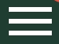 (en haut à gauche) : *Mes saisies*, *Mes visites*, *Explorer*, *Gestion des cartes*. Une **pastille rouge** signale qu'il vous reste des observations à envoyer.
- **Ouvrir les Paramètres**  (en haut à droite). Une pastille **verte** = tout est prêt pour saisir ; **rouge** = la configuration est incomplète.
- **Voir le numéro de version** (en bas). En le touchant, vous ouvrez l'écran de mise à jour (une pastille apparaît quand une nouvelle version est disponible).

---

## Paramètres (engrenage)

À faire à la première utilisation, et à chaque changement de serveur ou de compte.

  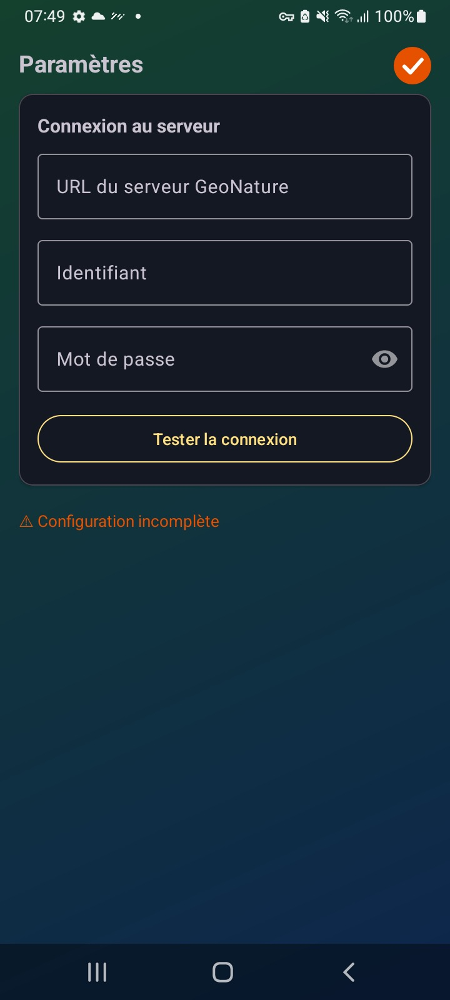
  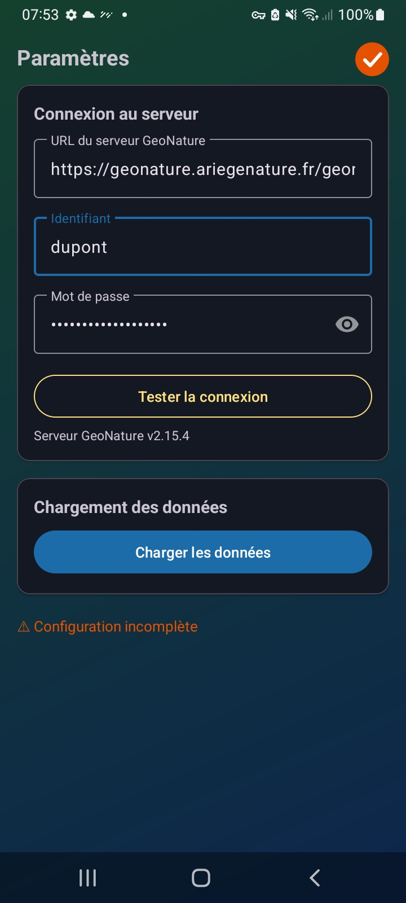
  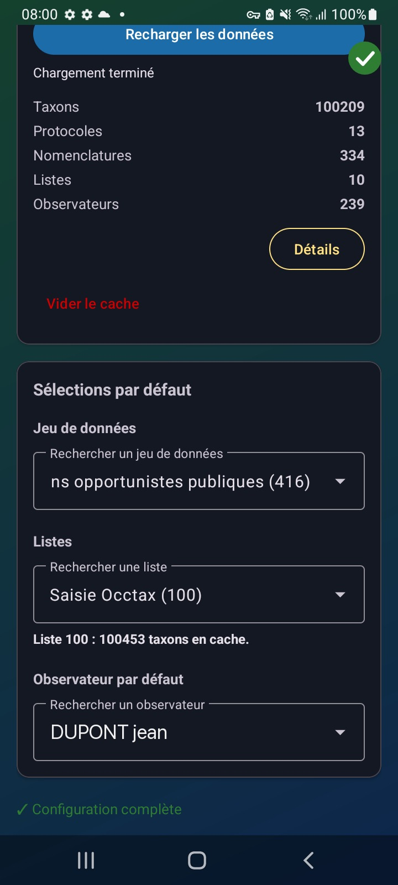

*De gauche à droite : écran initial · connexion réussie (bouton « Charger les données ») · données chargées + sélections par défaut.*

**Vous pouvez :**
- **Saisir l'adresse du serveur, votre identifiant et votre mot de passe**, puis **tester la connexion** (une coche verte confirme que le serveur répond et vous reconnaît).
- **Charger les données** du serveur en une fois : jeux de données, listes d'espèces, observateurs, dictionnaire des noms d'espèces, protocoles de suivi. *(Quelques minutes selon le serveur. À refaire de temps en temps pour récupérer les nouveautés.)*
- **Choisir vos valeurs par défaut** : le **jeu de données**, la **liste d'espèces** autorisées, votre **nom d'observateur** (pré-rempli dans vos saisies).
- **Voir ce qui est enregistré dans le téléphone** (nombre de protocoles, d'espèces…) et, via **Détails**, parcourir les espèces par groupe.
- **Vider le cache** (à n'utiliser qu'en cas de problème : il faudra recharger les données ensuite).
- **Valider** avec  (coche verte, en haut à droite).

---

## Saisie multi-taxons (OccTax) — la carte

L'écran carte sur lequel vous vous déplacez et placez vos observations.

  
  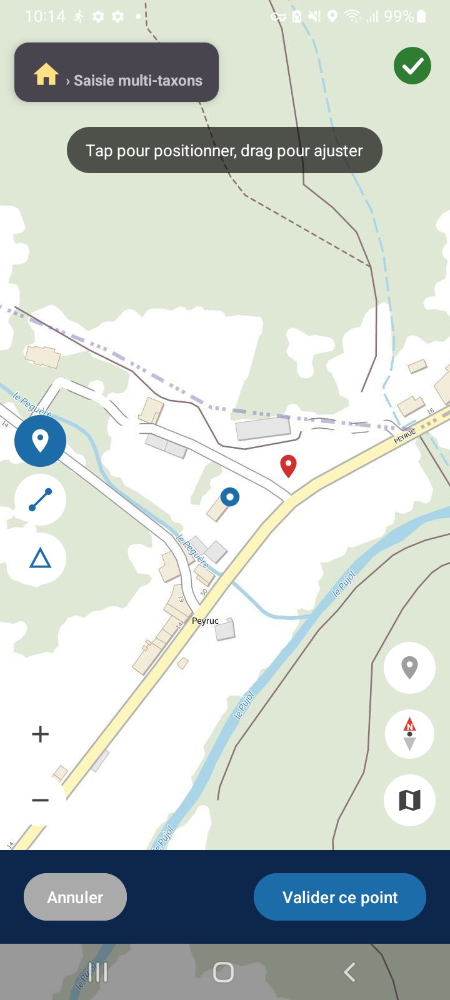

**Vous pouvez :**
- **Voir votre position** sur la carte (le point bleu 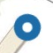) et **recentrer dessus** avec 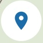.
- **Zoomer** avec 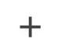 et 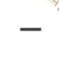, ou avec deux doigts.
- **Changer le fond de carte** avec  : plusieurs fonds disponibles (carte générale, fonds IGN, photo aérienne…).
- **Orienter la carte** avec la boussole 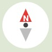.
- **Démarrer / arrêter l'enregistrement du tracé** de votre déplacement (si « Enregistrer la trace » est activé sur l'accueil). Une barre indique la distance et le nombre d'observations.
- **Placer le point d'une observation** : soit sur votre position GPS, soit en **touchant la carte** à l'endroit voulu, puis **Valider ce point**.
- **Ajouter un relevé** avec 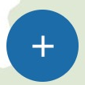.
- **Terminer la sortie** avec  (en haut à droite) : vous choisissez d'enregistrer, de continuer, ou de supprimer. *(La sortie est de toute façon enregistrée au fur et à mesure ; rien n'est encore envoyé.)*

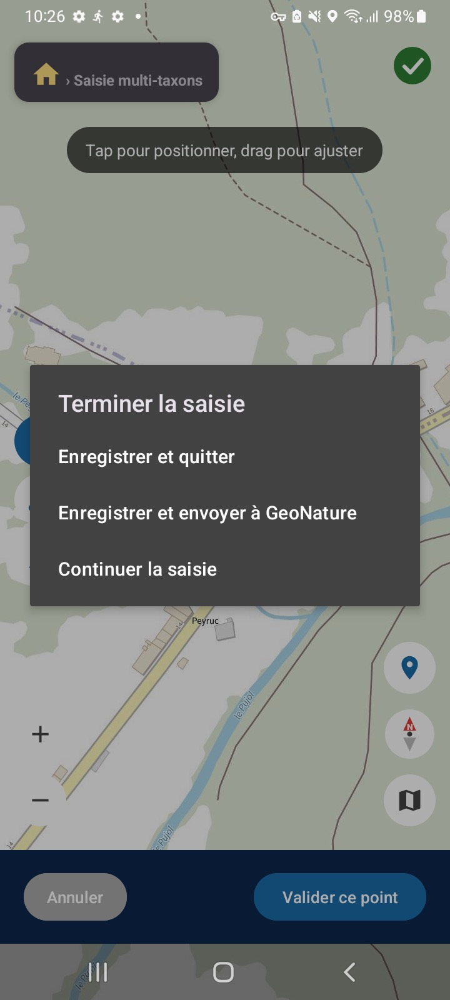

---

## Nouveau relevé (choix des espèces)

L'écran où vous indiquez quelles espèces vous avez observées à ce point.

  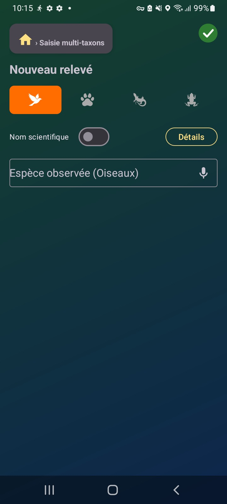
  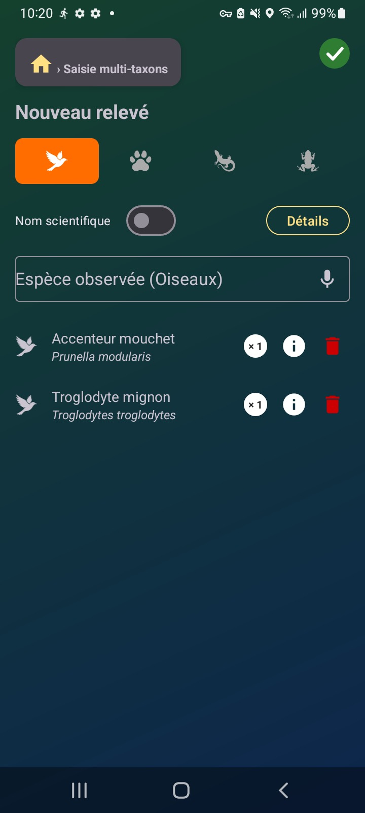

**Vous pouvez :**
- **Choisir le groupe d'espèces** dans le bandeau d'icônes (oiseaux, mammifères, reptiles, amphibiens, mollusques, poissons, insectes, autres invertébrés, flore, champignons) — cela filtre les propositions.
- **Saisir le nom** d'une espèce (en français ou en scientifique) : des propositions apparaissent au fil de la frappe.
- **Dicter le nom à la voix**  — fonctionne aussi **sans réseau** si le modèle vocal français est installé sur le téléphone.
- **Ajouter plusieurs espèces** au même relevé.
- Pour chaque espèce : **Dénombrement** , **Caractérisation** , ou **supprimer** 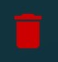.
- Ouvrir les **Détails du relevé** (date, observateurs, habitat, commentaire…).
- **Valider**  pour revenir à la carte.

---

## Dénombrement

Pour préciser combien d'individus et ajouter des médias.

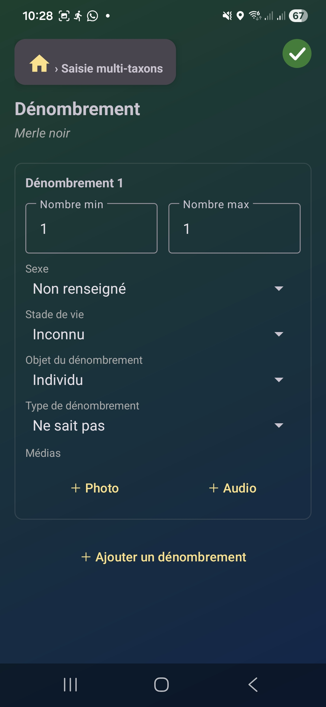

**Vous pouvez :**
- **Indiquer le nombre d'individus** (minimum / maximum) avec  et 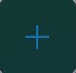.
- **Préciser** l'objet du dénombrement, le type de dénombrement, le stade de vie, le sexe…
- **Ajouter des photos**  : **prendre une photo** avec l'appareil, ou **en choisir une dans la galerie**.
- **Ajouter des sons** 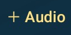 (enregistrements audio existants).

---

## Caractérisation

Pour décrire l'observation plus finement.

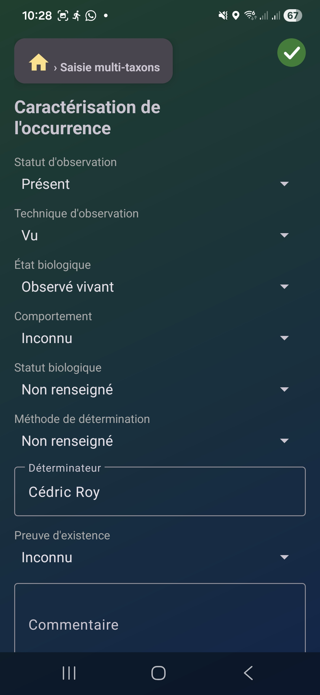

**Vous pouvez :**
- Préciser la **technique d'observation**, l'**état biologique**, le **comportement** (par ex. indices de nidification pour les oiseaux), et les autres informations proposées.

---

## Détails du relevé

Les informations communes à toutes les espèces d'un même relevé.

**Vous pouvez :**
- **Modifier la date et l'heure** du relevé.
- **Changer le jeu de données**.
- **Ajouter ou retirer des observateurs**.
- **Renseigner l'habitat**, un **commentaire**, et les autres champs proposés (altitude, précision…).

---

## Observations (relevés de la sortie en cours)

La liste de tout ce que vous avez noté pendant la sortie.

**Vous pouvez :**
- **Voir tous les relevés** de la sortie en cours.
- **Modifier**  ou **supprimer**  un relevé.
- **Tout effacer**.

---

## Saisie mono-taxon (OccTax, « rapide »)

Pour noter rapidement une seule espèce sur plusieurs points.

  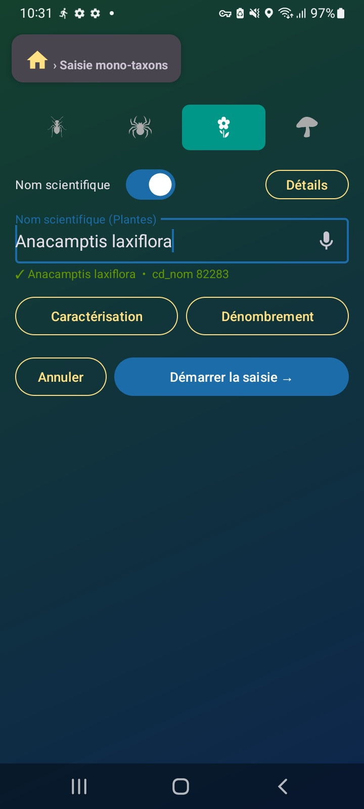
  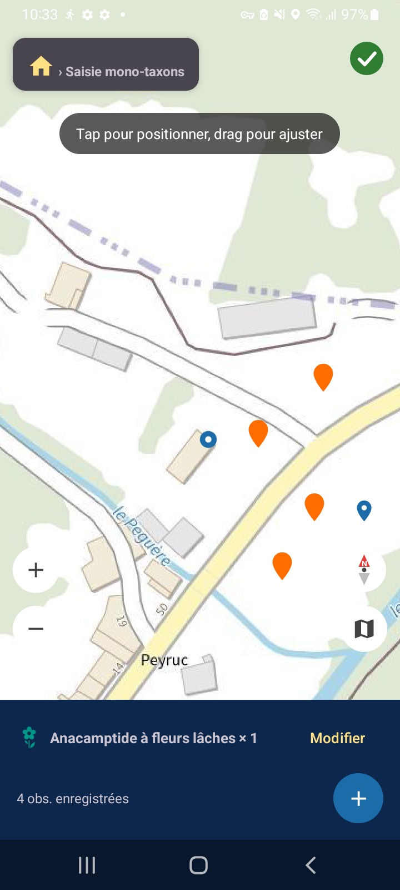

**Vous pouvez :**
- **Choisir l'espèce** (une seule) puis **Démarrer la saisie**.
- **Placer des points** d'observation : position GPS ou tap sur la carte, puis  pour valider.
- **Enchaîner** autant de points que nécessaire pour la même espèce.
- **Zoomer**  , **recentrer** , **changer le fond de carte** .
- **Terminer** . *(Tout est enregistré au fur et à mesure ; vous retrouvez la saisie dans « Mes saisies ».)*

---

## Monitoring (liste des protocoles)

L'entrée vers les suivis protocolés. Visible seulement si vous avez accès à au moins un protocole.

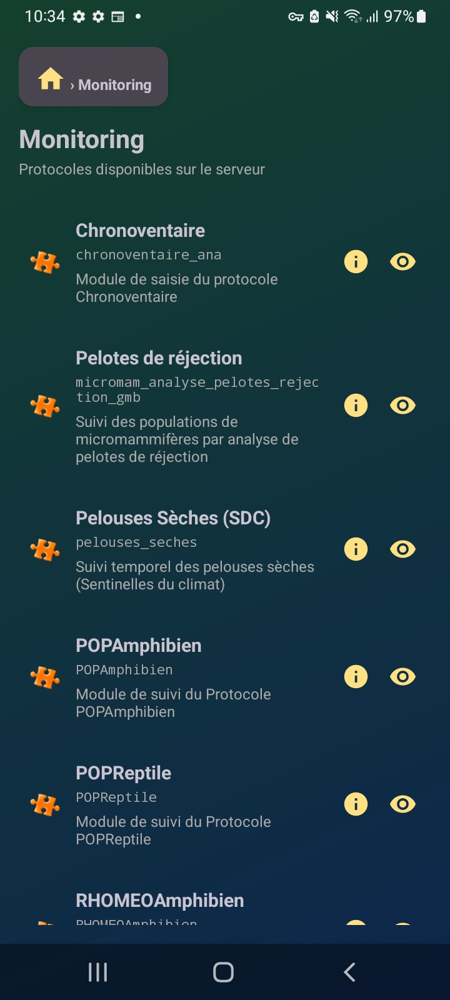

**Vous pouvez :**
- **Voir la liste des protocoles** auxquels votre compte a droit.
- Pour chaque protocole, ouvrir sa **fiche**  ou sa **carte**  (tous les sites du protocole).
- Accéder aux **données en attente d'envoi** (bandeau en haut quand il y en a).

---

## Fiche d'un protocole / d'un site

Le même écran sert à tous les niveaux (protocole, site, point d'écoute…). On y descend de proche en proche.

  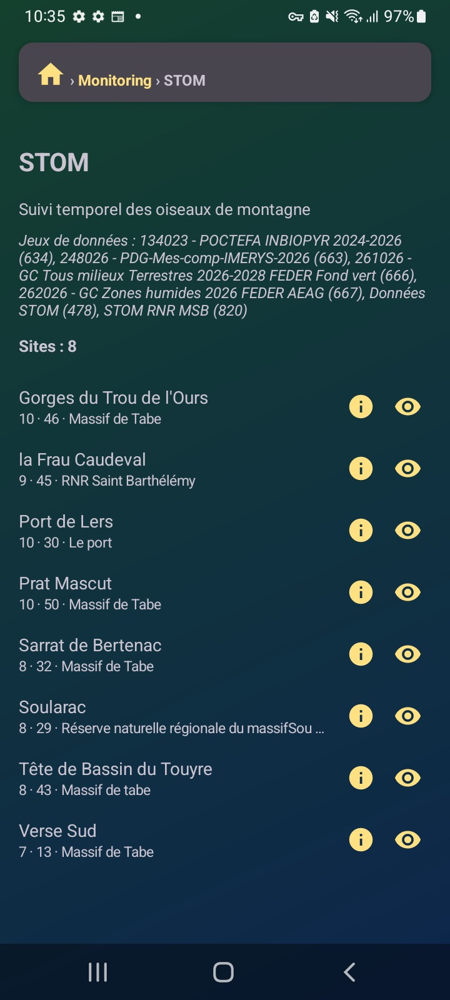
  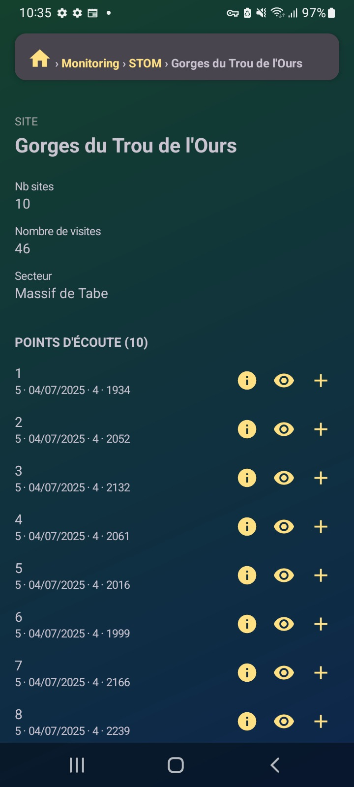

**Vous pouvez :**
- **Voir les informations** de l'objet courant et la **liste de ses sous-objets** (regroupés par type).
- **Descendre** dans un sous-objet (**Détails**).
- **Voir sur la carte** (si l'objet a une géométrie).
- **Créer une nouvelle visite / un passage / une observation** , selon ce que le protocole autorise.
- **Remonter** à n'importe quel niveau via le **fil d'Ariane** (le chemin cliquable en haut de l'écran : `Monitoring › Protocole › Site › …`).

---

## Carte d'un site

La carte qui montre la géométrie d'un site et de ses points.

  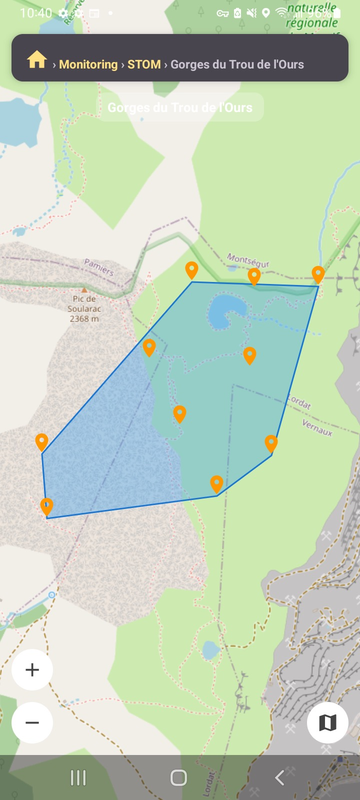
  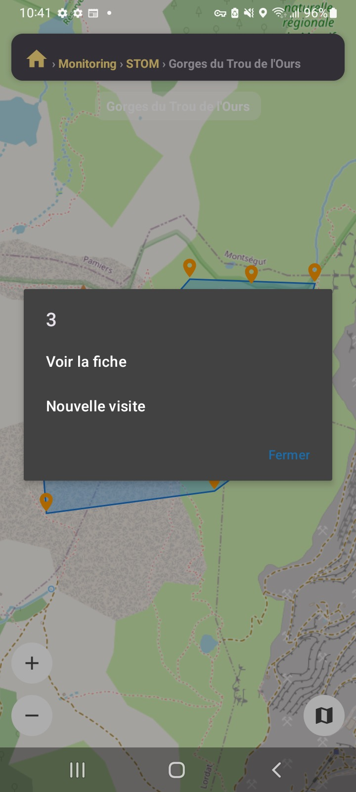

**Vous pouvez :**
- **Voir le site et ses points** (points d'écoute, sous-objets…).
- **Toucher un point** : un menu propose de **voir sa fiche** ou de **créer une nouvelle visite / un passage** sur ce point.
- **Zoomer**  , **changer le fond de carte** , **recentrer** .

---

## Nouvelle visite (formulaire)

Le formulaire de saisie d'un suivi. Son contenu dépend du protocole.

  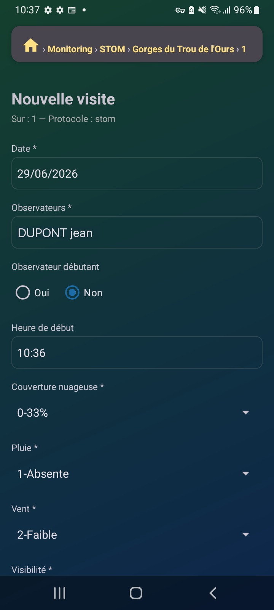
  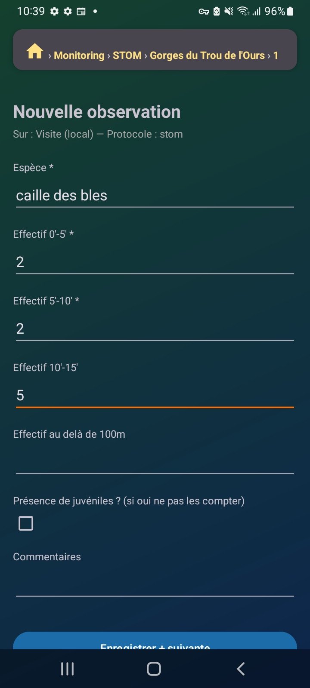

**Vous pouvez :**
- **Remplir les champs** définis par le protocole : texte, nombre, date, heure, cases à cocher, listes, et **espèce** (avec propositions et dictée vocale).
- Les **champs obligatoires** sont marqués d'une étoile **\*** ; le bouton **Enregistrer** reste grisé tant qu'ils ne sont pas remplis.
- **Ajouter une photo** .
- **Enregistrer** (dans le téléphone). L'application propose ensuite d'**enchaîner** directement l'observation suivante.

---

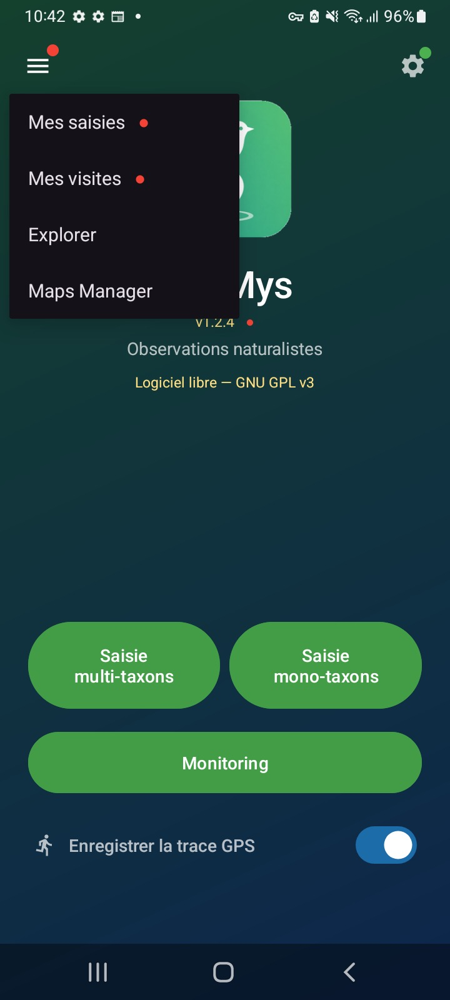

*Les écrans suivants — Mes saisies, Mes visites, Explorer, Gestion des cartes — s'ouvrent depuis le menu (icône en haut à gauche de l'accueil).*

---

## Mes saisies

Vos sorties OccTax enregistrées dans le téléphone (saisies multi et mono-taxons).

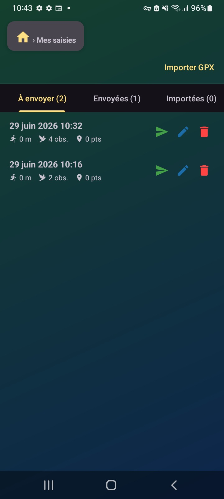

**Vous pouvez :**
- **Voir vos sorties**, classées : *à envoyer*, *envoyées*, *importées*.
- **Continuer une sortie**  (la rouvrir pour la compléter).
- **Envoyer une sortie** au serveur . Si la connexion coupe en cours d'envoi, la sortie reste en local : vous relancez plus tard.
- **Supprimer une sortie** .
- **Ouvrir le détail** d'une sortie.

---

## Détail d'une sortie

Le récapitulatif d'une sortie avant envoi.

**Vous pouvez :**
- **Voir la carte** (tracé + points) et la **liste des espèces**.
- **Envoyer** la sortie au serveur .
- **Exporter en GPX** un fichier partageable (mail, Drive…).

---

## Mes visites

Vos saisies de suivi (visites, passages, observations) en attente d'envoi.

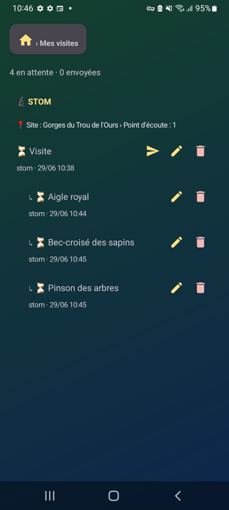

**Vous pouvez :**
- **Voir les saisies** en attente, regroupées par protocole, avec leur état (en attente, envoyée, en erreur).
- **Envoyer un groupe**  (une visite et ses observations) — l'envoi est toujours **manuel**, vous décidez quand.
- **Modifier**  ou **supprimer**  une saisie.
- **Réessayer** une saisie en erreur.

---

## Explorer

Pour visualiser les observations déjà présentes sur le serveur.

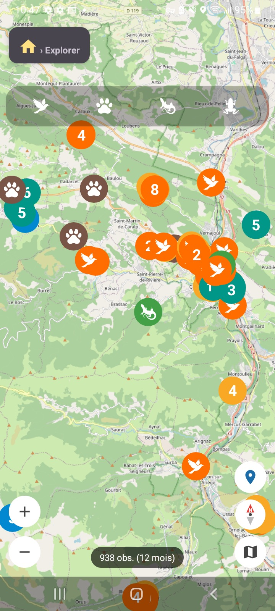

**Vous pouvez :**
- **Voir sur la carte** les observations de la **synthèse** GeoNature (de la dernière année).
- **Filtrer par groupe d'espèces** (bandeau d'icônes en haut).
- **Zoomer**  , **changer le fond de carte** , **vous recentrer** .
- Voir le **nombre d'observations** affichées (en bas).

---

## Gestion des cartes hors-ligne

Pour préparer le terrain quand il n'y aura pas de réseau.

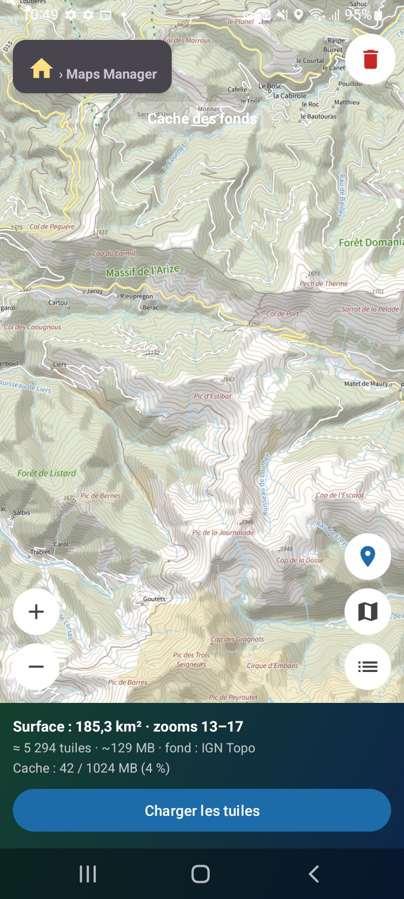

**Vous pouvez :**
- **Choisir une zone** sur la carte, ou **cadrer automatiquement l'emprise sur un protocole** via le bouton 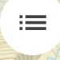 (en bas à droite) : la carte se cale sur l'étendue des sites de ce protocole.
- **Choisir le fond de carte**  et le **niveau de zoom** à télécharger.
- **Télécharger** les cartes pour les consulter ensuite sans réseau.
- **Voir l'espace utilisé** et **vider** le cache des cartes.

*(Limites : environ 200 km² par téléchargement ; au-delà d'1 Go par fond, les cartes les moins consultées sont supprimées automatiquement.)*

---

## Liste des taxons

Ouverte depuis les Paramètres (bouton « Détails »).

**Vous pouvez :**
- **Parcourir les espèces** d'un groupe ou d'une liste (nom français, nom scientifique).

---

## Mise à jour

Ouvert en touchant le numéro de version sur l'accueil.

**Vous pouvez :**
- **Vérifier** si une nouvelle version existe.
- **Télécharger et installer** la mise à jour.

---

© ANA - CEN Ariège
