# GeoMys — Guide écran par écran

Ce guide présente **chaque écran de l'application** et **ce que vous pouvez y faire**, en langage simple. Pour une prise en main pas à pas, voir aussi le [mode d'emploi](MODE_EMPLOI.md).

GeoMys sert à **noter des observations naturalistes sur le terrain** et à les envoyer ensuite à votre serveur **GeoNature** — qu'il s'agisse de saisies libres (**OccTax**), de suivis protocolés (**monitoring**, `gn_module_monitoring`) ou de relevés d'habitats (**OccHab**). L'application fonctionne **sans réseau** une fois les données chargées : vos observations sont gardées dans le téléphone et envoyées quand vous le décidez.

---

## Écran d'accueil

C'est le point de départ. Tout part d'ici.

  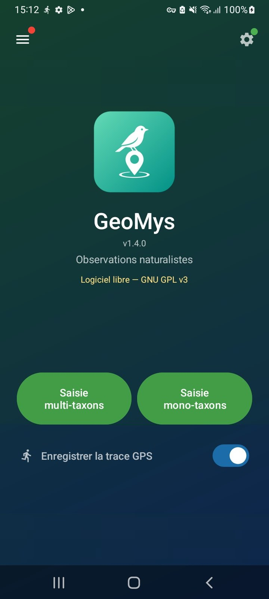
  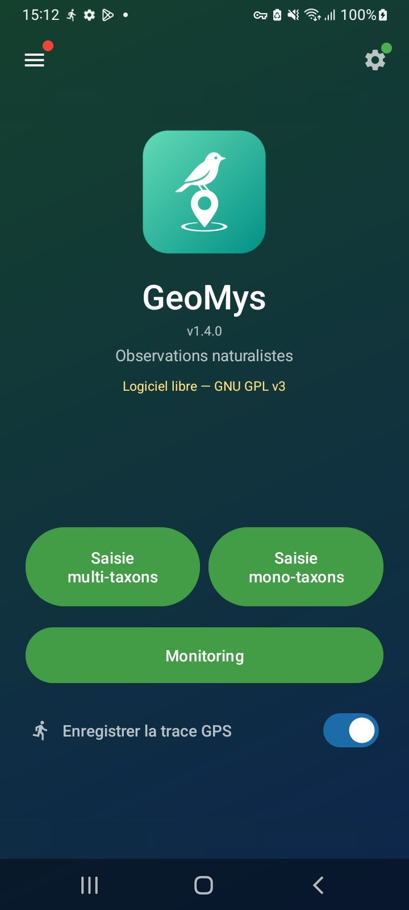
  

*Le même écran, vu par trois comptes différents : à gauche un compte qui n'a que les saisies OccTax ; au milieu, un compte qui a aussi accès aux protocoles de suivi ; à droite, un compte qui a en plus le module habitats.*

**Vous pouvez :**
- **Démarrer une saisie « multi-taxons » (OccTax)** — pour noter plusieurs espèces le long d'un parcours, sur une carte.
- **Démarrer une saisie « mono-taxon » (OccTax, « rapide »)** — pour noter une seule espèce, sur plusieurs points, rapidement.
- **Ouvrir « Monitoring »** (suivis de protocoles, `gn_module_monitoring`) — voir plus bas : ce bouton dépend de vos droits.
- **Ouvrir « OccHab »** (relevés d'habitats) — une **station** (un point ou un polygone) et les **habitats** qu'on y observe. Dépend aussi de vos droits.
- **Activer/désactiver « Enregistrer la trace GPS »** — quand c'est activé, l'application peut enregistrer le tracé de votre déplacement pendant une saisie multi-taxons.
- **Ouvrir le menu** 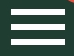 (en haut à gauche) : *Mes saisies*, *Mes visites*, *Mes stations*, *Explorer*, *Maps Manager*. Une **pastille rouge** signale qu'il vous reste des données à envoyer.
- **Ouvrir les Paramètres**  (en haut à droite). Une pastille **verte** = tout est prêt pour saisir ; **rouge** = la configuration est incomplète.
- **Voir le numéro de version** (en bas). En le touchant, vous ouvrez l'écran de mise à jour (une pastille apparaît quand une nouvelle version est disponible).

### Pourquoi votre accueil n'est pas celui de votre collègue

Comme le montrent les trois copies d'écran ci-dessus, **l'accueil n'a pas la même allure d'un compte à l'autre**. Ce n'est pas un réglage de l'application : elle **reflète simplement ce que le serveur lui répond**.

Deux raisons se cumulent :

1. **GeoNature est modulaire.** Toutes les instances n'installent pas les mêmes modules. Le suivi de protocoles (`gn_module_monitoring`) et les relevés d'habitats (OccHab) sont des modules **optionnels** : sur un serveur qui ne les a pas, il n'y a rien à proposer.
2. **Les droits sont attribués compte par compte.** Même quand le module existe, l'administrateur décide qui peut le consulter et y saisir. Un salarié suivant un protocole précis, un bénévole, un stagiaire n'auront pas les mêmes accès.

L'application **masque** ce à quoi vous n'avez pas droit plutôt que de le griser : proposer un bouton qui mènerait à un refus du serveur n'aiderait personne.

| Bouton | Apparaît seulement si… |
|---|---|
| **Saisie multi-taxons** et **mono-taxon** | toujours — la saisie OccTax est le socle de l'application |
| **Monitoring** | vous avez accès à **au moins un protocole** de suivi |
| **OccHab** | le module **OccHab** est installé sur le serveur **et** vous avez le droit d'y **créer** des stations |

Deux conséquences pratiques :

- **Le menu suit la même règle** : *Mes visites* n'apparaît qu'avec l'accès aux protocoles, *Mes stations* qu'avec l'accès à OccHab. Le compte de gauche voit donc un menu à trois entrées seulement. Les compteurs des Paramètres se comportent de la même façon.
- **Changer de serveur change l'accueil.** Le même téléphone, connecté à une autre instance GeoNature, peut afficher plus ou moins de boutons.

> **Un bouton attendu n'apparaît pas ?** Vos droits sont relevés **pendant « Recharger les données »**, pas en continu. Après une correction faite par l'administrateur GeoNature, il faut donc **relancer un chargement** dans les Paramètres pour que le bouton apparaisse.

---

## Paramètres (engrenage)

À faire à la première utilisation, et à chaque changement de serveur ou de compte.

  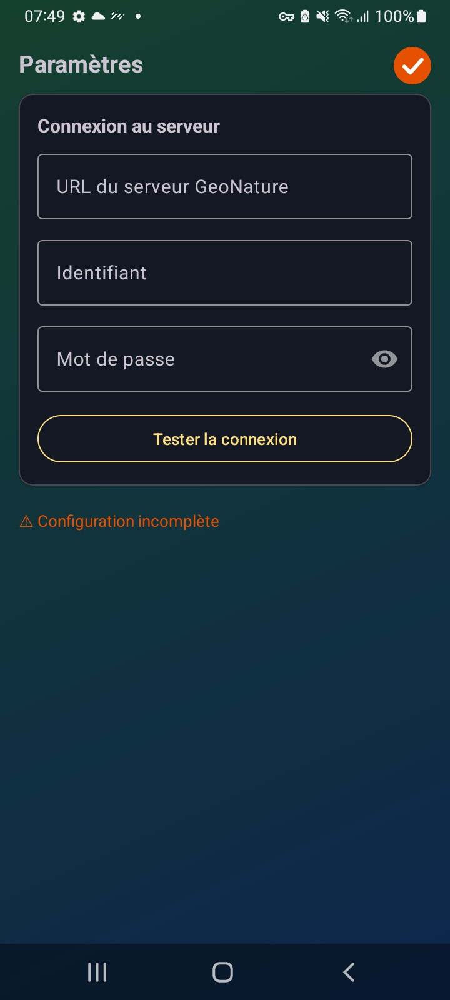
  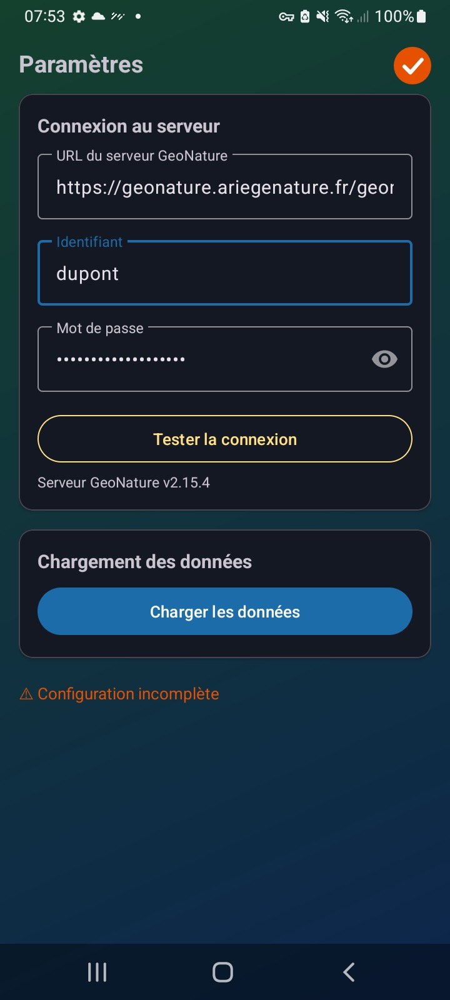
  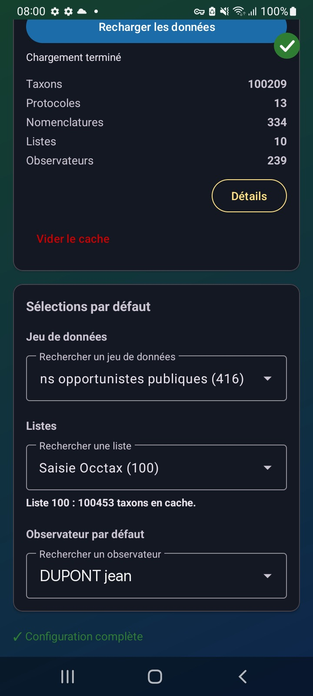

*De gauche à droite : écran initial · connexion réussie (bouton « Charger les données ») · données chargées + sélections par défaut.*

**Vous pouvez :**
- **Saisir l'adresse du serveur, votre identifiant et votre mot de passe**, puis **tester la connexion** (une coche verte confirme que le serveur répond et vous reconnaît).
- **Charger les données** du serveur en une fois : jeux de données, listes d'espèces, observateurs, dictionnaire des noms d'espèces, protocoles de suivi. *(Quelques minutes selon le serveur. À refaire de temps en temps pour récupérer les nouveautés.)*
- **Choisir vos valeurs par défaut** : le **jeu de données**, la **liste d'espèces** autorisées, votre **nom d'observateur** (pré-rempli dans vos saisies).
- **Voir ce qui est enregistré dans le téléphone** et, via **Détails**, parcourir les espèces par groupe. Les compteurs affichés **suivent vos droits** : *Protocoles* n'apparaît que si vous avez accès à au moins un protocole de suivi, *Stations OccHab* que si le module OccHab vous est ouvert. Les autres (taxons, nomenclatures, listes, observateurs) sont toujours là.
- **Vider le cache** (à n'utiliser qu'en cas de problème : il faudra recharger les données ensuite).
- **Valider** avec 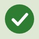 (coche verte, en haut à droite).

**Bon à savoir :**
- La boîte « Chargement des données » reste **consultable sans réseau** dès que des données sont présentes dans le téléphone : les compteurs décrivent ce que vous avez **en local**.
- Après certaines mises à jour, l'application **exige un rechargement des données** : elle ouvre les Paramètres au démarrage et le demande avant de vous laisser continuer. **Vos saisies en attente sont conservées** et pourront être envoyées ensuite.

---

## Saisie multi-taxons (OccTax) — la carte

L'écran carte sur lequel vous vous déplacez et placez vos observations.

  
  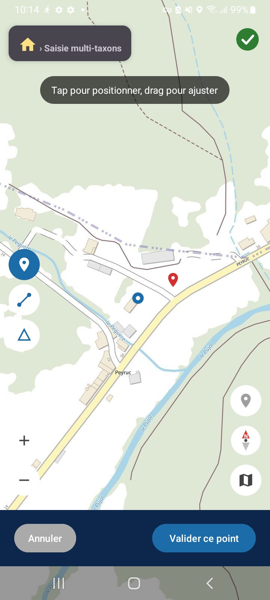

**Vous pouvez :**
- **Voir votre position** sur la carte (le point bleu 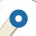) et **recentrer dessus** avec 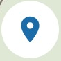.
- **Zoomer** avec 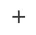 et 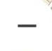, ou avec deux doigts.
- **Changer le fond de carte** avec  : plusieurs fonds disponibles (carte générale, fonds IGN, photo aérienne…).
- **Orienter la carte** avec la boussole 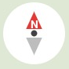.
- **Démarrer / arrêter l'enregistrement du tracé** de votre déplacement (si « Enregistrer la trace » est activé sur l'accueil). Une barre indique la distance et le nombre d'observations.
- **Placer le point d'une observation** : soit sur votre position GPS, soit en **touchant la carte** à l'endroit voulu, puis **Valider ce point**.
- **Ajouter un relevé** avec 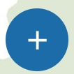.
- **Terminer la sortie** avec  (en haut à droite) : vous choisissez d'enregistrer, de continuer, ou de supprimer. *(La sortie est de toute façon enregistrée au fur et à mesure ; rien n'est encore envoyé.)*

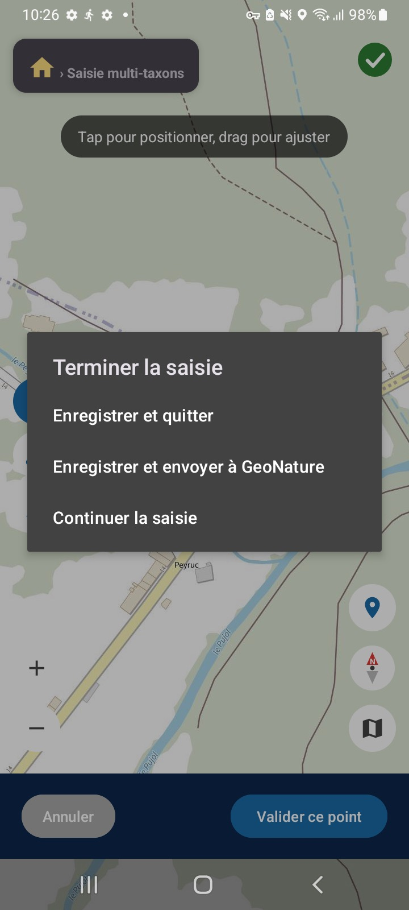

---

## Nouveau relevé (choix des espèces)

L'écran où vous indiquez quelles espèces vous avez observées à ce point.

  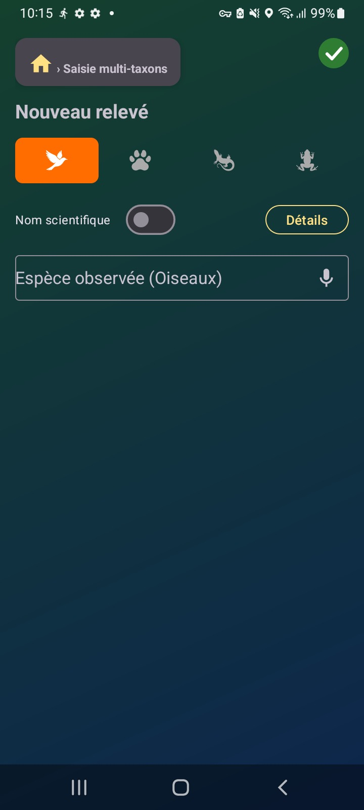
  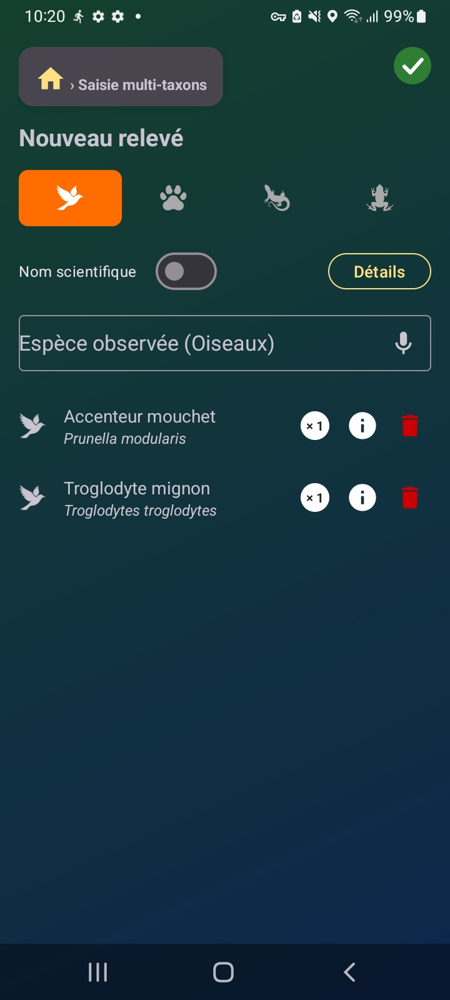

**Vous pouvez :**
- **Choisir le groupe d'espèces** dans le bandeau d'icônes (oiseaux, mammifères, reptiles, amphibiens, mollusques, poissons, insectes, autres invertébrés, flore, champignons) — cela filtre les propositions.
- **Saisir le nom** d'une espèce (en français ou en scientifique) : des propositions apparaissent au fil de la frappe.
- **Dicter le nom à la voix**  — fonctionne aussi **sans réseau** si le modèle vocal français est installé sur le téléphone.
- **Ajouter plusieurs espèces** au même relevé.
- Pour chaque espèce : **Dénombrement** 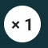, **Caractérisation** , ou **supprimer** 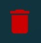.
- Ouvrir les **Détails du relevé** (date, observateurs, habitat, commentaire…).
- **Valider**  pour revenir à la carte.

---

## Dénombrement

Pour préciser combien d'individus et ajouter des médias.

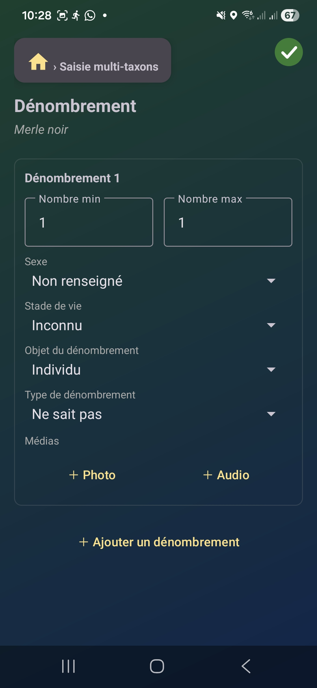

**Vous pouvez :**
- **Indiquer le nombre d'individus** (minimum / maximum) avec 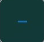 et 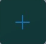.
- **Préciser** l'objet du dénombrement, le type de dénombrement, le stade de vie, le sexe…
- **Ajouter des photos**  : **prendre une photo** avec l'appareil, ou **en choisir une dans la galerie**.
- **Ajouter des sons** 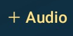 (enregistrements audio existants).

---

## Caractérisation

Pour décrire l'observation plus finement.

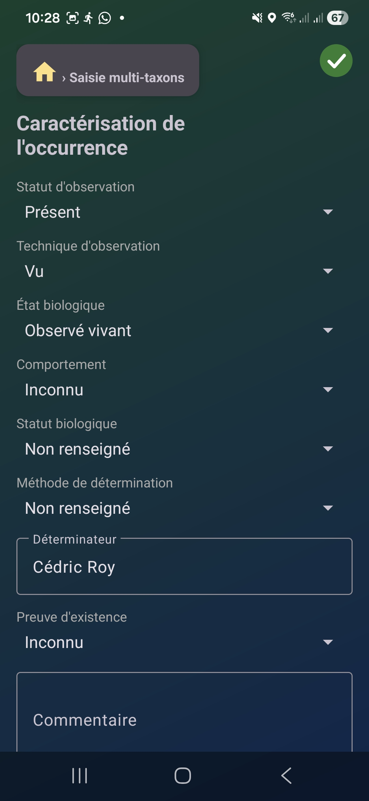

**Vous pouvez :**
- Préciser la **technique d'observation**, l'**état biologique**, le **comportement** (par ex. indices de nidification pour les oiseaux), et les autres informations proposées.

---

## Détails du relevé

Les informations communes à toutes les espèces d'un même relevé.

**Vous pouvez :**
- **Modifier la date et l'heure** du relevé.
- **Changer le jeu de données**.
- **Ajouter ou retirer des observateurs**.
- **Renseigner l'habitat**, un **commentaire**, et les autres champs proposés (altitude, précision…).

---

## Observations (relevés de la sortie en cours)

La liste de tout ce que vous avez noté pendant la sortie.

**Vous pouvez :**
- **Voir tous les relevés** de la sortie en cours.
- **Modifier** 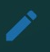 ou **supprimer**  un relevé.
- **Tout effacer**.

---

## Saisie mono-taxon (OccTax, « rapide »)

Pour noter rapidement une seule espèce sur plusieurs points.

  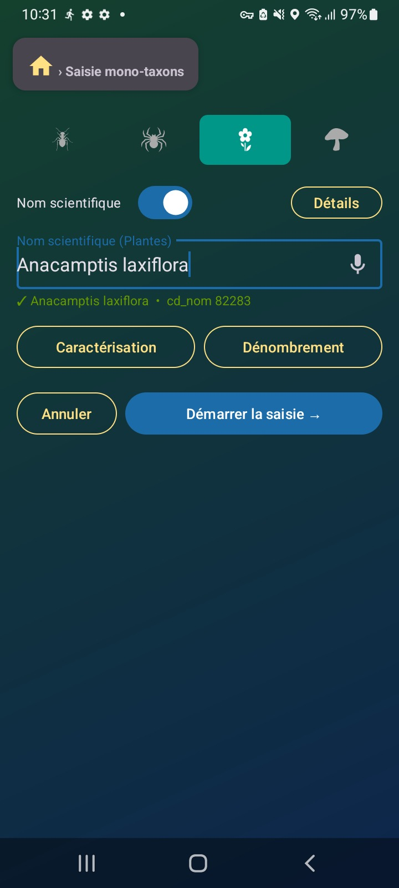
  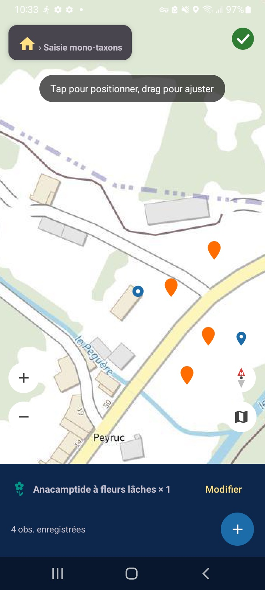

**Vous pouvez :**
- **Choisir l'espèce** (une seule) puis **Démarrer la saisie**.
- **Placer des points** d'observation : position GPS ou tap sur la carte, puis  pour valider.
- **Enchaîner** autant de points que nécessaire pour la même espèce.
- **Zoomer**  , **recentrer** , **changer le fond de carte** .
- **Terminer** . *(Tout est enregistré au fur et à mesure ; vous retrouvez la saisie dans « Mes saisies ».)*

---

## Monitoring (liste des protocoles)

L'entrée vers les suivis protocolés. Visible seulement si vous avez accès à au moins un protocole.

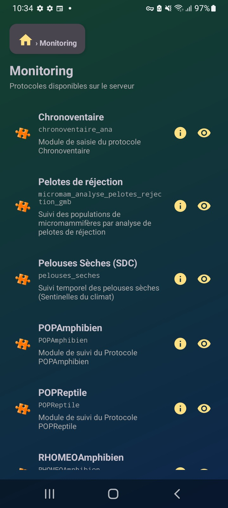

**Vous pouvez :**
- **Voir la liste des protocoles** auxquels votre compte a droit.
- Pour chaque protocole, ouvrir sa **fiche** 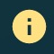 ou sa **carte**  (tous les sites du protocole).
- Accéder aux **données en attente d'envoi** (bandeau en haut quand il y en a).

---

## Fiche d'un protocole / d'un site

Le même écran sert à tous les niveaux (protocole, site, point d'écoute…). On y descend de proche en proche.

  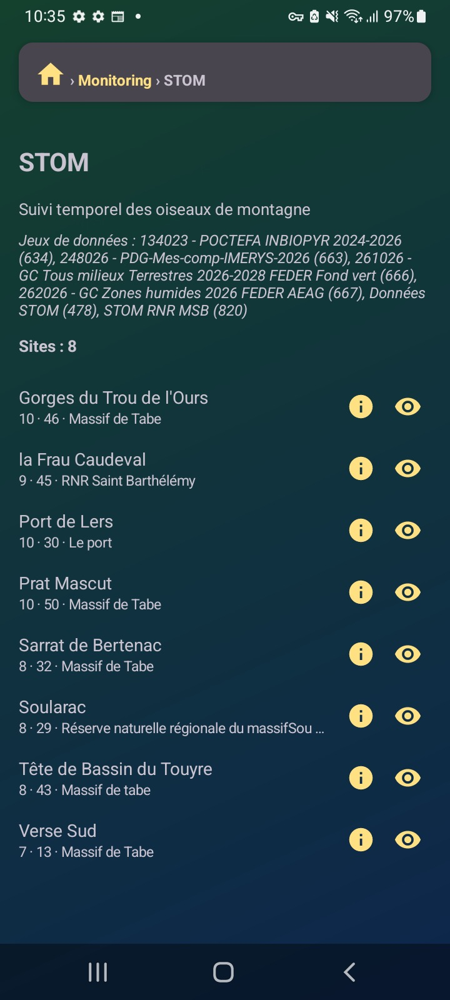
  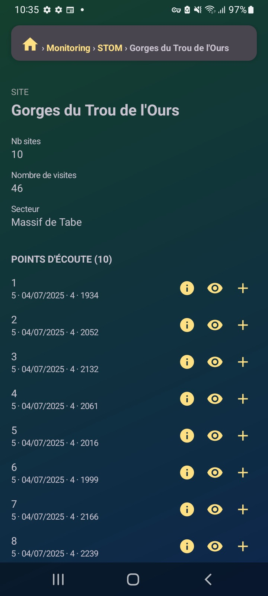

**Vous pouvez :**
- **Voir les informations** de l'objet courant et la **liste de ses sous-objets** (regroupés par type).
- **Descendre** dans un sous-objet (**Détails**).
- **Voir sur la carte** (si l'objet a une géométrie).
- **Créer une nouvelle visite / un passage / une observation** , selon ce que le protocole autorise.
- **Remonter** à n'importe quel niveau via le **fil d'Ariane** (le chemin cliquable en haut de l'écran : `Monitoring › Protocole › Site › …`).

---

## Carte d'un site

La carte qui montre la géométrie d'un site et de ses points.

  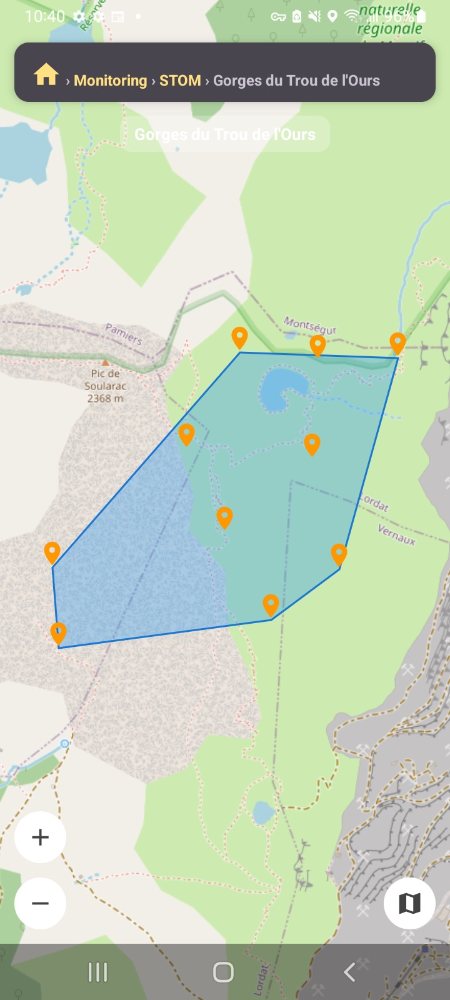
  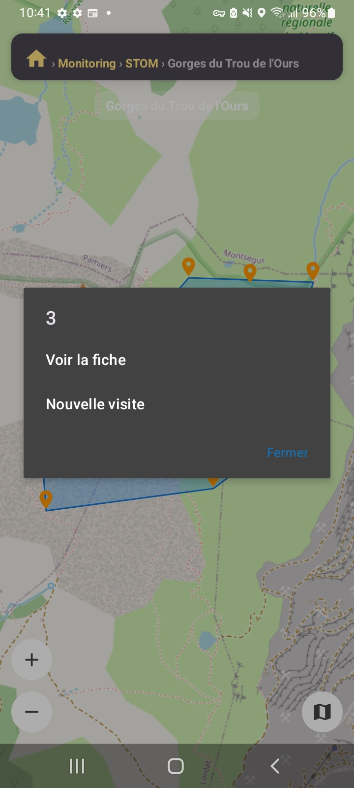

**Vous pouvez :**
- **Voir le site et ses points** (points d'écoute, sous-objets…).
- **Toucher un point** : un menu propose de **voir sa fiche** ou de **créer une nouvelle visite / un passage** sur ce point.
- **Zoomer**  , **changer le fond de carte** , **recentrer** .

---

## Nouvelle visite (formulaire)

Le formulaire de saisie d'un suivi. Son contenu dépend du protocole.

  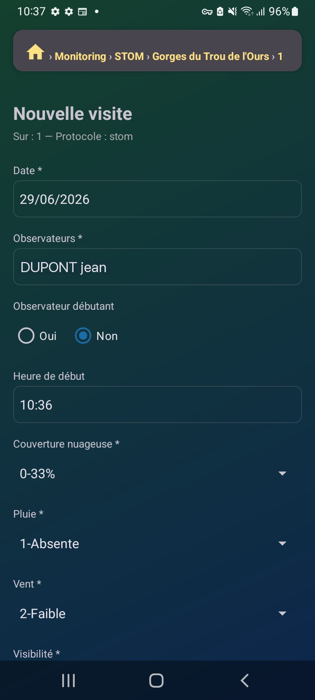
  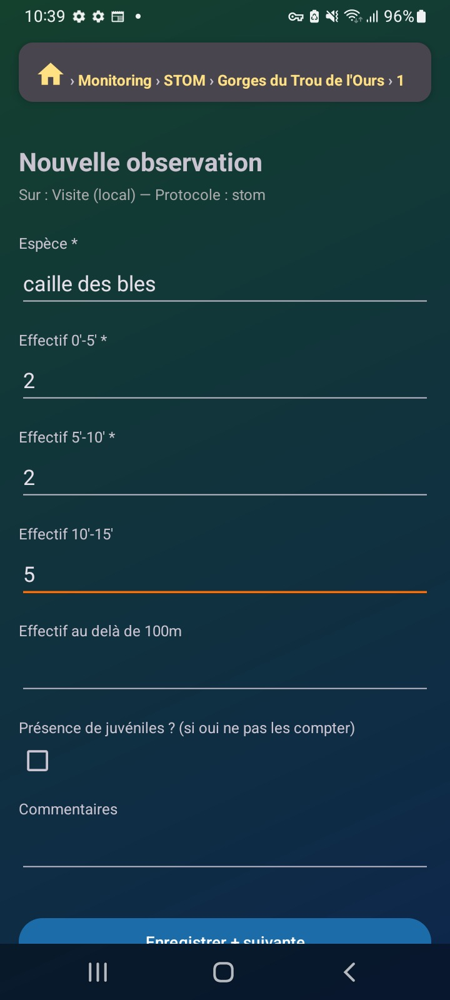

**Vous pouvez :**
- **Remplir les champs** définis par le protocole : texte, nombre, date, heure, cases à cocher, listes, et **espèce** (avec propositions et dictée vocale).
- Les **champs obligatoires** sont marqués d'une étoile **\***.
- **Ajouter une photo** .
- **Enregistrer** (dans le téléphone). L'application propose ensuite d'**enchaîner** directement l'observation suivante.

### Les informations de fin de visite

Certains protocoles demandent des informations qu'on ne connaît **qu'à la fin** : heure de fin, température de fin, durée… Vous n'avez donc **pas besoin de les inventer au départ** :

- vous pouvez **enregistrer la visite sans les remplir** — elle est conservée dans le téléphone, marquée **à compléter** ;
- au moment de **Terminer**, l'application vous propose de la compléter, puisque vous connaissez alors ces valeurs ;
- tant qu'il manque un champ obligatoire, la visite **ne part pas** au serveur : dans *Mes visites*, sa flèche d'envoi est **rouge**, et la toucher ouvre le formulaire sur les champs à finir (chacun signalé par une **barre rouge**).

*Cela ne vaut que pour les informations générales de la visite. Une **saisie d'espèce**, elle, reste bloquée tant que ses champs obligatoires ne sont pas remplis.*

---

## OccHab — démarrer un relevé d'habitat

OccHab sert à décrire **où** vous êtes (une **station** : un point ou un polygone) et **quels habitats** s'y trouvent. À l'ouverture, l'application demande d'abord les informations communes au relevé.

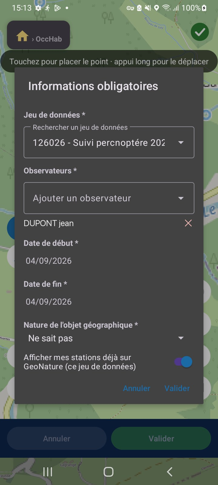

**Vous pouvez :**
- **Choisir le jeu de données**, les **observateurs**, les **dates** de début et de fin, et la **nature de l'objet géographique**. Les champs marqués **\*** sont obligatoires.
- Le formulaire est **pré-rempli avec votre relevé précédent** (les dates repartent du jour) : en général, il n'y a qu'à valider.
- **Afficher vos stations déjà sur GeoNature** (interrupteur en bas) : coché par défaut, il fait apparaître sur la carte les stations que vous avez déjà envoyées, pour les retrouver et les modifier. Si vous le décochez, l'application s'en souvient pour les relevés suivants et la carte se centre sur votre position.
- **Annuler** pour revenir à l'accueil.

Ces informations restent modifiables ensuite, station par station, avec le bouton **ⓘ** de la carte ou **Détails** sur l'écran des habitats.

---

## OccHab — la carte des stations

La carte sur laquelle vous dessinez vos stations et retrouvez celles du serveur.

  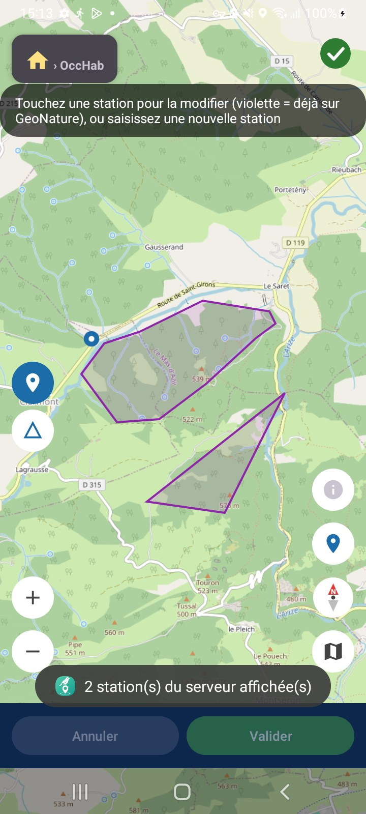
  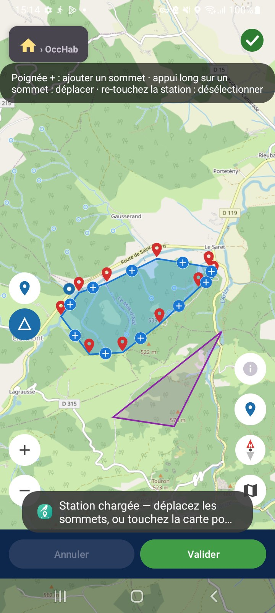

*À gauche : vos stations déjà sur GeoNature, en violet. À droite : une station ouverte en modification.*

**Vous pouvez :**
- **Saisir une nouvelle station** : en **point** (touchez la carte) ou en **polygone** (touchez pour poser les sommets, au moins 3).
- **Modifier une station** : touchez-la, puis **déplacez un sommet** (appui long) ou **ajoutez-en un** avec une **poignée +** au milieu d'une arête. Re-toucher la station la **désélectionne**.
- **Raccorder deux stations voisines** : un sommet posé près d'un sommet existant s'y **aimante** exactement. Ensuite, déplacer ce sommet commun déplace **les deux** polygones — les limites restent jointives.
- **Annuler** la dernière opération (sommet ajouté, déplacé, inséré), y compris son effet sur le polygone voisin. Plusieurs *Annuler* remontent les opérations une à une.
- **Reprendre une station du serveur** (en **violet**) : touchez-la, confirmez, et elle s'ouvre dans votre relevé. À l'envoi, elle repartira en **mise à jour** de la station existante — jamais en double. Une station reprise dans une **autre** saisie apparaît en **orange pointillé** : la toucher propose d'ouvrir cette saisie.
- **Modifier les informations** de la station sélectionnée avec **ⓘ**, **zoomer**  , **recentrer** , **changer le fond** .
- **Valider** la géométrie pour passer aux **habitats**, ou **terminer le relevé** avec  (en haut à droite).

**Bon à savoir :**
- Vos stations du serveur sont **enregistrées dans le téléphone** lors du « Recharger les données » : elles s'affichent donc **même sans réseau** (l'application indique alors la date du dernier chargement).
- Une station reprise du serveur n'entre dans **Mes stations** qu'à partir du moment où vous la **modifiez** réellement. La consulter ne crée rien.
- Une station dessinée sous QGIS peut comporter un **trou** (un polygone intérieur). Il s'affiche en creux, ses sommets se modifient comme les autres, et il est **conservé** quand la station repart au serveur.

---

## OccHab — les habitats d'une station

Une fois la géométrie validée, vous décrivez le ou les habitats observés sur la station.

  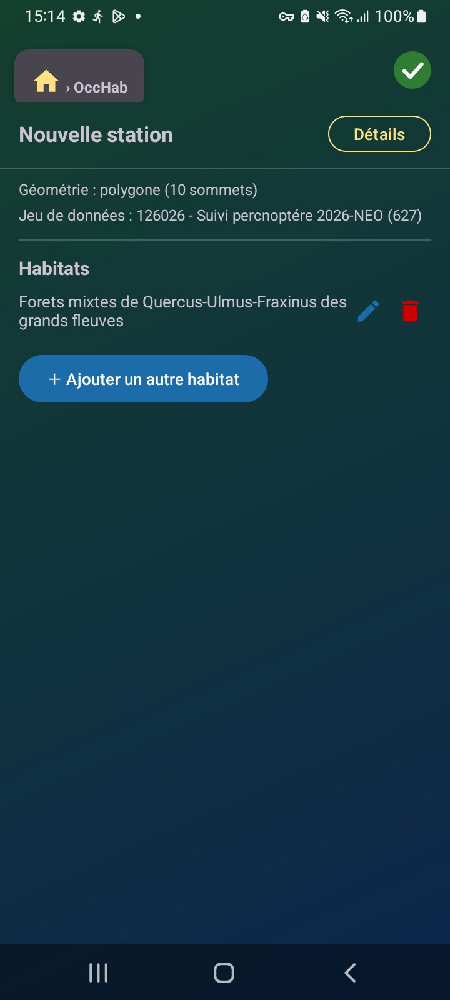
  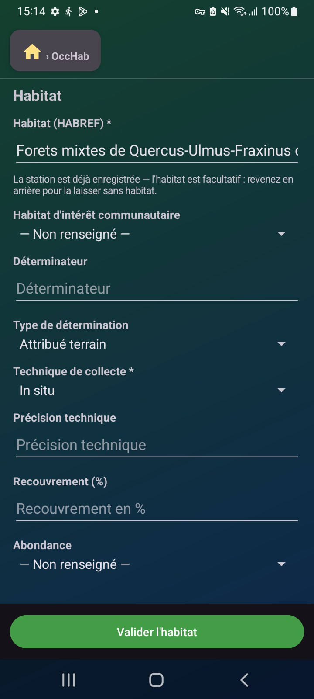

**Vous pouvez :**
- **Voir le résumé de la station** (type de géométrie, nombre de sommets, jeu de données) et rouvrir ses informations avec **Détails**.
- **Ajouter un habitat**, le **modifier**  ou le **supprimer** .
- Dans le formulaire d'un habitat : choisir l'**habitat HABREF** (propositions au fil de la frappe, **hors ligne**), le **déterminateur**, le **type de détermination**, la **technique de collecte**, le **recouvrement en %**, l'**abondance**…
- **Valider l'habitat** pour revenir à la liste.
- Sur les stations issues du **plugin QGIS de l'ANA**, une section **« Évaluation ANA / Natura 2000 »** apparaît en plus (enjeu, état de conservation, typicité…) : vous pouvez la modifier, le reste du commentaire n'est jamais touché.

*Une station peut être enregistrée et envoyée **sans habitat** ; les habitats se complètent plus tard.*

---

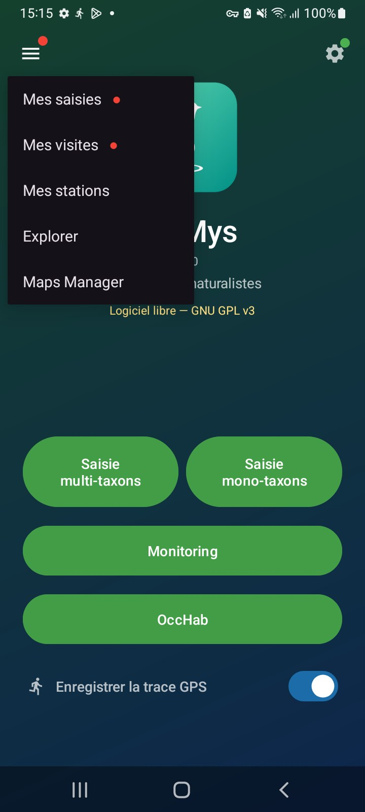

*Les écrans suivants — Mes saisies, Mes visites, Mes stations, Explorer, Maps Manager — s'ouvrent depuis le menu (icône en haut à gauche de l'accueil). Rappel : « Mes visites » et « Mes stations » n'apparaissent qu'avec les droits correspondants.*

---

## Mes saisies

Vos sorties OccTax enregistrées dans le téléphone (saisies multi et mono-taxons).

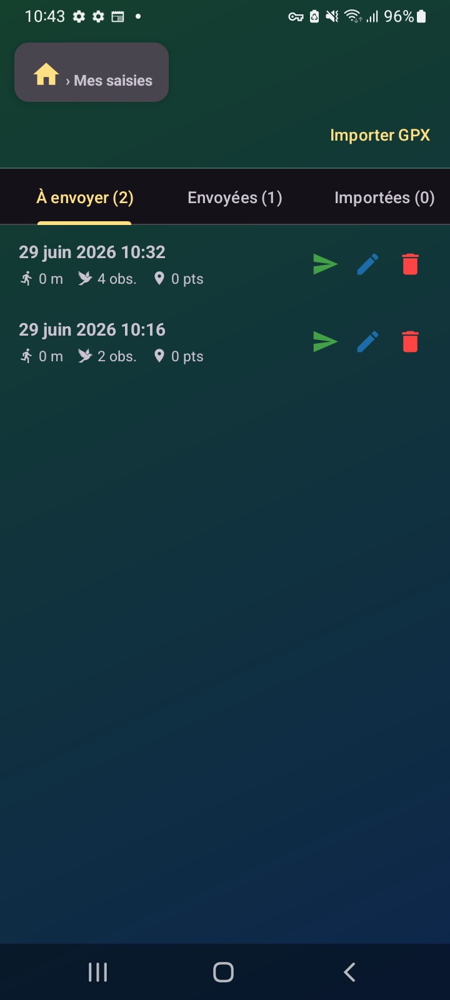

**Vous pouvez :**
- **Voir vos sorties**, classées : *à envoyer*, *envoyées*, *importées*.
- **Continuer une sortie**  (la rouvrir pour la compléter).
- **Envoyer une sortie** au serveur 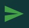. Si la connexion coupe en cours d'envoi, la sortie reste en local : vous relancez plus tard.
- **Supprimer une sortie** .
- **Ouvrir le détail** d'une sortie.

---

## Détail d'une sortie

Le récapitulatif d'une sortie avant envoi.

**Vous pouvez :**
- **Voir la carte** (tracé + points) et la **liste des espèces**.
- **Envoyer** la sortie au serveur .
- **Exporter en GPX** un fichier partageable (mail, Drive…).

---

## Mes visites

Vos saisies de suivi (visites, passages, observations) en attente d'envoi.

  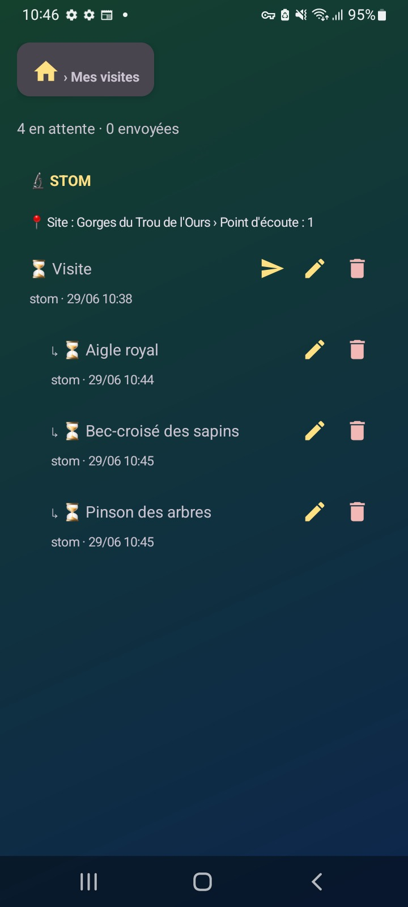
  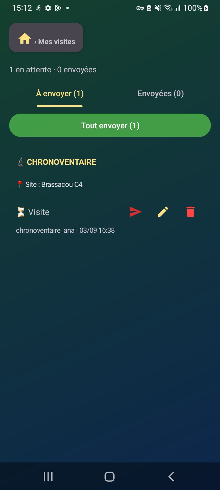

*À droite : une visite **à compléter** — sa flèche d'envoi est rouge.*

**Vous pouvez :**
- **Voir les saisies** en attente, regroupées par protocole et par site, avec leur état : ⏳ en attente, 🚀 en cours d'envoi, ✅ envoyée, ⚠ en erreur. Le compteur en haut ne totalise que les **visites** (ou passages, transects…), pas les espèces qu'elles contiennent.
- **Envoyer un groupe**  (une visite et ses observations) — l'envoi est toujours **manuel**, vous décidez quand. **Tout envoyer** transmet l'ensemble en une fois.
- **Modifier**  ou **supprimer**  une saisie. Après modification, l'application enchaîne sur la saisie des espèces, comme à la création.
- **Réessayer** une saisie en erreur.
- **Compléter une visite** dont la flèche est **rouge** : la toucher ouvre son formulaire sur les champs obligatoires manquants. Tant qu'ils ne sont pas remplis, ni la visite ni ses espèces ne partent — les autres visites du lot, elles, sont envoyées normalement.

---

## Mes stations

Vos relevés d'habitats (OccHab) enregistrés dans le téléphone.

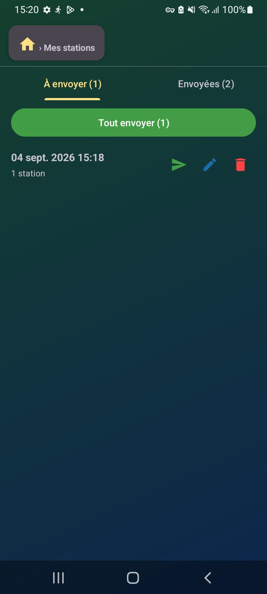

**Vous pouvez :**
- **Voir vos relevés**, classés *à envoyer* et *envoyées*, avec le nombre de stations de chacun.
- **Envoyer un relevé** , ou **Tout envoyer**. Une station reprise du serveur repart en **mise à jour**, jamais en double.
- **Rouvrir un relevé**  pour le compléter : vous revenez sur la carte, avec ses stations affichées.
- **Supprimer un relevé**  (localement — rien n'est effacé sur GeoNature).

---

## Explorer

Pour visualiser les observations déjà présentes sur le serveur.

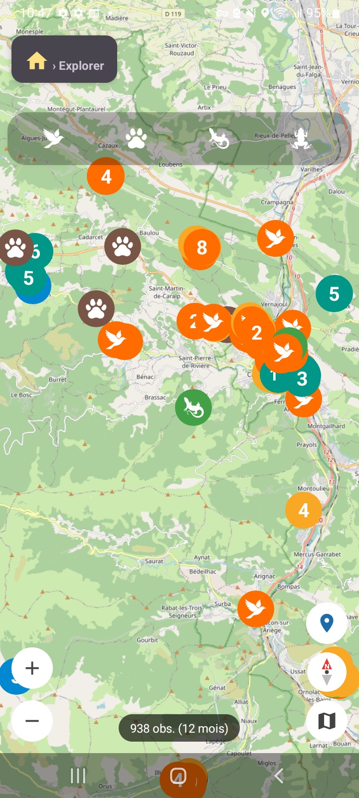

**Vous pouvez :**
- **Voir sur la carte** les observations de la **synthèse** GeoNature (de la dernière année).
- **Filtrer par groupe d'espèces** (bandeau d'icônes en haut).
- **Zoomer**  , **changer le fond de carte** , **vous recentrer** .
- Voir le **nombre d'observations** affichées (en bas).

---

## Gestion des cartes hors-ligne

Pour préparer le terrain quand il n'y aura pas de réseau.

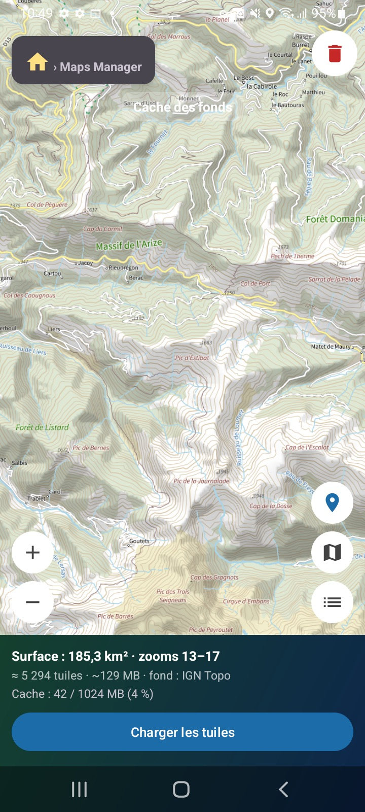

**Vous pouvez :**
- **Choisir une zone** sur la carte, ou **cadrer automatiquement l'emprise sur un protocole** via le bouton 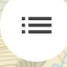 (en bas à droite) : la carte se cale sur l'étendue des sites de ce protocole.
- **Choisir le fond de carte**  et le **niveau de zoom** à télécharger.
- **Télécharger** les cartes pour les consulter ensuite sans réseau.
- **Voir l'espace utilisé** et **vider** le cache des cartes.

*(Limites : environ 200 km² par téléchargement ; au-delà d'1 Go par fond, les cartes les moins consultées sont supprimées automatiquement.)*

---

## Liste des taxons

Ouverte depuis les Paramètres (bouton « Détails »).

**Vous pouvez :**
- **Parcourir les espèces** d'un groupe ou d'une liste (nom français, nom scientifique).

---

## Mise à jour

Ouvert en touchant le numéro de version sur l'accueil.

**Vous pouvez :**
- **Vérifier** si une nouvelle version existe.
- **Télécharger et installer** la mise à jour.

*Cet écran n'existe que sur la version installée **depuis GitHub**. Si vous avez installé GeoMys **depuis le Play Store**, c'est le Store qui gère les mises à jour : toucher le numéro de version n'ouvre rien.*

---

© ANA - CEN Ariège
