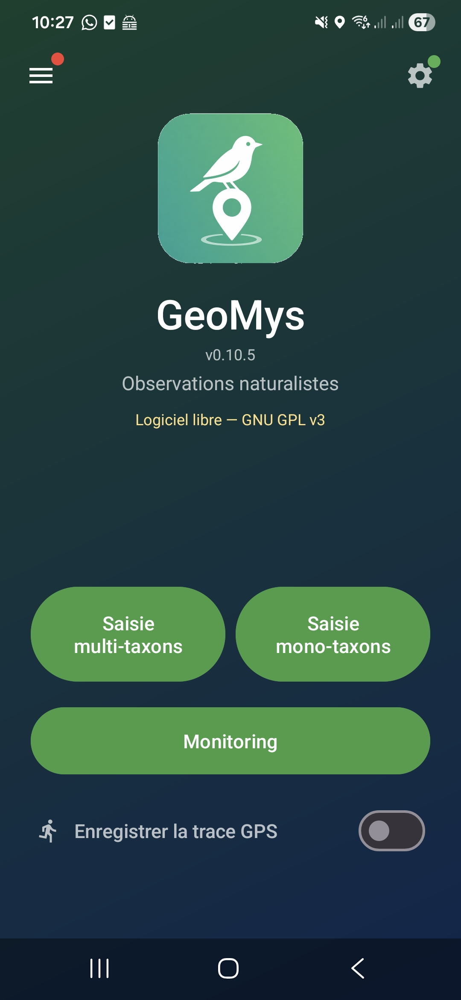
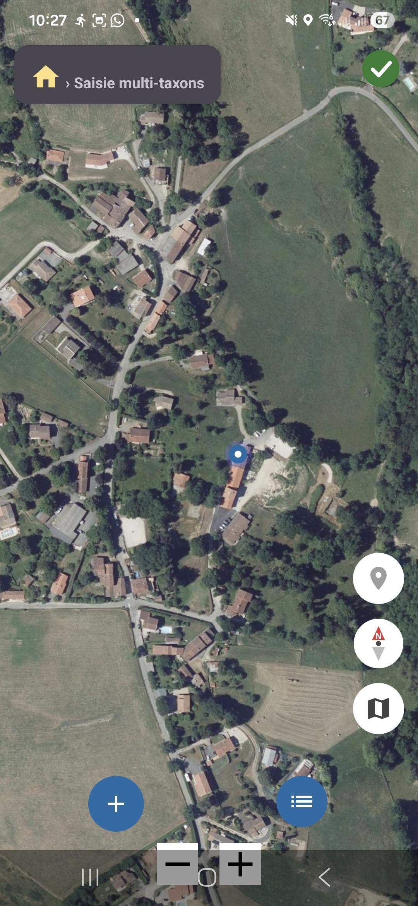
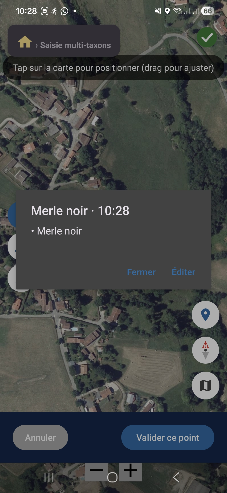
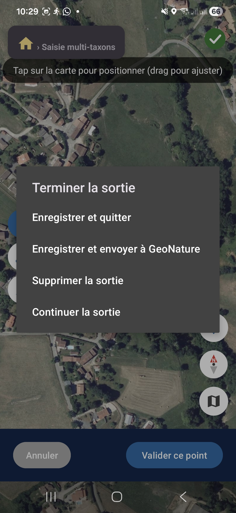

# GeoMys — Mode d'emploi

Application Android de terrain pour la saisie naturaliste connectée à un serveur [GeoNature](https://github.com/PnX-SI/GeoNature). Ce guide couvre la prise en main et l'utilisation au quotidien.

<p align="center">
  
  
  
  
</p>

---

## 1. Installation

1. Télécharger l'application depuis ce lien [Latest version](https://github.com/ANA-CEN-Ariege/GeoMys-android/releases/latest/download/app-release.apk) ou la dernière version (`app-release.apk`) depuis la page [Releases GitHub](https://github.com/ANA-CEN-Ariege/GeoMys-android/releases) ou .
3. Sur Android, autoriser l'installation depuis des sources inconnues si demandé.
4. Ouvrir le fichier APK et installer.

Aucun compte spécifique à créer : on utilise un compte **GeoNature** existant.

---

## 2. Première configuration

À la première ouverture, taper sur l'icône **engrenage ⚙️** en haut à droite.

### a. Connexion au serveur

| Champ | Valeur |
|---|---|
| URL du serveur | (L'URL de votre serveur GeoNature, exemple : https://geonature.ariegenature.fr/geonature) |
| Identifiant | (Votre nom d'utilisateur GeoNature) |
| Mot de passe | (votre mot de passe GeoNature) |

Taper **Connexion** : la coche verte indique que le serveur répond et que vos identifiants sont reconnus.

### b. Charger les données

Une fois la connexion validée, le bouton **Charger les données** apparaît. Il télécharge en une seule passe :

- la liste des **jeux de données** auxquels vous avez accès,
- les **listes de taxons** disponibles (biblistes TaxHub),
- les **observateurs** (membres des listes UsersHub),
- le **référentiel TaxRef** complet (noms français et scientifiques) pour l'autocomplétion,
- les **nomenclatures** (types de comptage, stades de vie, statuts, etc.),
- les **protocoles de suivi** (`gn_module_monitoring`) auxquels vous avez droit, avec leur schéma et l'arborescence de leurs sites.

⏱️ Compter quelques minutes selon la taille du serveur et la qualité de la connexion. À refaire périodiquement au cas où y a eu des changements côté serveur. Les taxons ne sont rechargés que si nécessaire (changement de version).

### c. Choisir les valeurs par défaut

Trois listes déroulantes apparaissent une fois le chargement terminé :

- **Jeu de données** — celui sur lequel vos saisies OccTax seront rattachées.
- **Liste de taxons** — restreint la liste des espèces autorisées. Si le jeu de données impose une liste, elle est automatiquement sélectionnée et verrouillée.
- **Observateur par défaut** — votre nom : pré-rempli dans toutes les saisies.

### d. Panneau « Données en cache »

Affiche en permanence :

```
Protocoles       N
Nomenclatures    M
Taxons           K     [ Détails ]
```

Le bouton **Détails** ouvre la liste des groupes taxonomiques (Oiseaux, Mammifères, …) avec leur effectif filtré par la liste sélectionnée. Un tap sur un groupe affiche la liste complète des taxons.

Le bouton **Vider le cache** efface les données locales (à n'utiliser qu'en cas de problème — il faudra resynchroniser).

Valider en haut à droite avec la **coche verte** : la configuration est sauvegardée.

---

## 3. Écran d'accueil

Trois entrées principales :

- **Saisie multi-taxons** — relevés OccTax pour plusieurs taxons.
- **Saisie mono-taxon (« rapide »)** — relevés éclair pour un taxon.
- **Suivis** — accès aux protocoles. Cette entrée n'est affichée que si vous avez les droits nécessaires pour au moins un protocole.

**Menu burger** (en haut à gauche) :

- **Mes saisies** — sorties OccTax enregistrées en attente d'envoi.
- **Mes visites** — saisies monitoring enregistrée en attente d'envoi.
- **Explorer** — affichage sur la carte des relevés du serveur enregistrés sur le serveur geonature dans la dernière année.
- **Cache Manager** — téléchargent des fonds de carte pour usage hors réseau.

**Enregistrer la trace**
- si cette coche est activé, lors d'une saisie dans les saisies multi-taxons, on peut démarrer et enregistrer la trace GPX du parcours.
---

## 4. Saisie multi-taxons (OccTax)

### Démarrer une sortie

Taper **Saisie multi-taxons** → la 1ère fois après l'installation, l'app demande la permission de localisation (à accepter pour l'enregistrement du parcours).

Si "Enregistrer la trace" est activée sur l'écran d'accueil, vous pouvez démarrer la trace de votre déplacement avec le bouton "Play".

Cliquer sur **➕** pour démarrer les saisies.

Pour positionner une localisation, vous pouvez soit utiliser votre position GPS, soit, en tapant sur la carte positionner un point GPS.

Cliquer sur **Valider ce point** pour séléctionner la position.

L'écran **Nouveau relevé** permet de sélectionner une ou plusieurs espèces, soit par leur nom français, soit par leur nom scientifique.

Tapez quelques lettres, et l'autocomplétion vous proposera une liste de taxons.

Les taxons proposés dépendront du groupe selectionné (bandeau défilant avec les icones des groupes) : oiseaux, Mammifères, reptiles, amphibiens, mollusques, poissons, insectes, autres invertébrés, flore, champignons.

Chaque observation est listée avec à droite 3 boutons : "Dénombrement", "Caractérisation" et "Supprimer".

### Dénombrement

Ce formulaire vous permet d'indiquer le nombre d'individus ainsi que d'autres informations (objet du dénombrement, type de dénombrement, stade de vie, sexe) . Il permet également d'ajouter une ou plusieurs photos ou des enregistrements sonores.

### Caractérisation

Ce formulaire vous permet de préciser des informations sur l'obervation : technique d'observation, état biologique, ...

A la fin du retevé, cliquez sur la coche verte en haut à droite pour revenir sur la carte précédente.

Sur cette carte, vous pouvez soit faire un nouveau relevé, soit terminer la sortiee avec la coche verte en haut à droite.

Les sorties, avec leurs relevés, sont automatiquement enregistrées. Vous pouvez les retrouver à partir de l'écran d'accueil, dans le menu burger en haut à gauche, dans "Mes saisies"

### Photo

Taper l'icône appareil. La photo est **rattachée à l'observation** et envoyée avec elle. Plusieurs photos par observation possibles.


### Terminer la sortie

Taper **Terminer** → la sortie est enregistrée localement en **brouillon**. À ce stade rien n'est encore envoyé au serveur.

### Auto-save au fil de l'eau

Depuis la v0.9.54, l'app enregistre **automatiquement** votre brouillon à chaque modification (avec un délai de quelques secondes). Si le téléphone se coupe ou plante, vous retrouvez le travail au démarrage suivant.

### Envoyer

Dans **Mes saisies** :

1. Choisir la sortie à envoyer.
2. Vérifier le récap (taxons, photos, parcours).
3. Taper **Envoyer** → l'app pousse vers `/api/occtax/releve` puis chaque média.

Si la connexion tombe pendant l'envoi, la sortie reste en local — il suffit de relancer plus tard.

### Export GPX

Depuis le détail d'une sortie : bouton **Exporter** → fichier `.gpx` partageable (mail, Drive, etc.).

---

## 5. Saisie rapide (mono-taxon)

Conçue pour les contacts ponctuels qu'on veut noter sans interrompre une marche.

1. Taper **Saisie mono-taxon** sur l'écran d'accueil.
2. La position GPS est captée immédiatement.
3. Taxon (autocomplétion) + photo (optionnelle) + commentaire.
4. **Valider** : la saisie est créée comme une sortie autonome (un seul relevé, un seul taxon) prête à envoyer.

---

## 6. Suivis protocolés (gn_module_monitoring)

### Liste des protocoles

Taper **Suivis** sur l'accueil. La liste affiche uniquement les protocoles auxquels **votre compte** a droit (filtrage CRUVED côté serveur + cache local).

> 💡 Si tu n'as accès à aucun protocole, le bouton **Suivis** et l'entrée **Mes visites** du menu burger disparaissent automatiquement — la place est laissée aux deux saisies OccTax.

Pour chaque protocole : icône **ℹ️** (fiche) ou **🗺️** (carte de tous les sites du protocole).

### Fiche d'un protocole

La fiche liste les **sites** (ou groupes de sites) avec leur nom et leurs propriétés clés. Pour chaque ligne :

- **ℹ️ Détails** — drill dans le site (sa fiche, ses visites/observations).
- **🗺️ Carte** — affiche la géométrie du site et de ses points d'écoute / sous-objets.
- **➕** — démarre directement une saisie (visite ou observation selon le schéma) sur ce site.

### Navigation par fil d'Ariane

En haut de chaque écran de suivi : un **fil d'Ariane cliquable**
`Suivis › Protocole › Site › Point › …` permettant de remonter à n'importe quel niveau.

### Carte interactive

Sur la carte d'un protocole ou d'un site, **un tap sur un marker / polygone** ouvre un dialog qui propose :

- **Voir la fiche** de l'objet cliqué,
- **Nouvelle saisie** (visite, observation, …) si le protocole le permet.

Le fil d'Ariane qui en résulte respecte la hiérarchie réelle de l'objet, quel que soit le chemin emprunté pour arriver à la carte.

### Formulaire de saisie dynamique

Les formulaires sont **construits à la volée** depuis le schéma du protocole envoyé par le serveur. L'app couvre 10 widgets : texte, nombre, date, heure, case à cocher, listes (simple / multiple), radios, et taxon (autocomplétion TaxRef).

Spécificités :

- les **champs obligatoires** sont signalés par `*` ; le bouton **Enregistrer** reste désactivé tant qu'ils ne sont pas remplis.
- les **bornes min/max** numériques sont vérifiées en direct (message d'erreur sous le champ).
- les **masquages conditionnels** déclarés par le schéma sont respectés (ex : un champ « comportement » qui n'apparaît que si « observation directe » est cochée).
- les **valeurs par défaut** du serveur sont pré-renseignées.
- les **règles `change`** (auto-remplissage de champs dépendants) sont appliquées au fil de la saisie.

### Enchaînement

Après la création d'une visite, l'app propose directement de créer l'observation enfant — pas besoin de retourner à la liste pour le « + » suivant.

### Saisies en attente

Bandeau **Saisies en attente d'envoi (N)** dans l'écran Suivis. Tape-y pour voir/éditer/envoyer chaque saisie locale.

L'**envoi est manuel** (jamais automatique). Tu choisis explicitement quand pousser au serveur.

---

## 7. Cartographie

Quatre fonds disponibles, basculables au tap sur l'icône en haut à droite de la carte :

- **OSM** — OpenStreetMap (généraliste).
- **IGN Topo** — fond topo IGN.
- **IGN Scan25** — cartes au 1:25 000 (terrain).
- **IGN Ortho** — orthophotos.

### Cache hors-réseau

Pour préparer une sortie sans couverture :

1. Menu burger → **Cache Manager**.
2. Choisir un protocole pour pré-cadrer sur ses sites, ou définir une zone manuellement.
3. Sélectionner le **fond** (à télécharger un seul à la fois) et le **zoom maximum** (jusqu'à 17 — équivaut au 1:18000).
4. Taper **Télécharger**.

⚠️ Limites :

- Surface maximale : ~200 km² par téléchargement.
- Plafond global : 1 Go par fond — au-delà, purge automatique LRU (= les tuiles les moins consultées sont supprimées).

---

## 8. Mode offline

L'app fonctionne **entièrement hors-réseau** une fois les données chargées :

- liste des protocoles, fiches, schémas — depuis le cache local,
- saisies — stockées en local, taggées comme « en attente d'envoi »,
- cartes — depuis les tuiles téléchargées,
- autocomplétion taxon — depuis le cache TaxRef.

Quand la connexion revient, les saisies en attente restent en local jusqu'à ce que **vous** lanciez explicitement l'envoi.

---

## 9. Cas particuliers et dépannage

### « Aucun protocole accessible »

Vous voyez ce message si le compte n'a aucun droit CRUVED sur les protocoles de l'instance. Vérifier côté GeoNature que les rôles attribués couvrent au moins la lecture sur les modules visés.

### Synchronisation incomplète

Si le bandeau de sync indique « étape(s) en échec », c'est qu'au moins un endpoint a renvoyé une erreur. On peut **relancer** sans tout perdre — les étapes réussies ne sont pas refaites tant que tu ne videras pas le cache.

### Le serveur a changé de version TaxRef

Un bandeau orange en haut de l'écran de config signale `TaxRef serveur v17 — cache v16`. Re-cliquer sur **Recharger les données** pour mettre à jour.

### Liste de taxons absente du cache

Si tu choisis un `id_liste` qui n'a pas été synchronisé, un avertissement orange apparaît. **Recharge les données** : le sync télécharge alors toutes les listes serveur, y compris la nouvelle.

### Une saisie monitoring partielle est-elle envoyable ?

Oui — l'auto-save crée un brouillon en `PENDING` dès le début de la saisie. Tu peux quitter et revenir : l'observation partielle est récupérée. Attention : si tu **envoies** une saisie partielle, le serveur la considèrera comme complète (à elle de te valider ou non selon ses contraintes).

### Photos manquantes après envoi ?

Vérifier le détail de la sortie côté serveur. Si une photo est marquée comme « envoyée » côté app mais absente serveur, c'est typiquement un timeout HTTP pendant le PUT. Recharger la sortie en local puis renvoyer.

---

## 10. Configuration avancée

### Champs additionnels

Si le serveur expose des `additional_fields` pour OCCTAX, ils sont automatiquement intégrés au formulaire de saisie multi-taxons.

### Changement de serveur ou de compte

Retour à **Configuration** → modifier URL / identifiants → **Connexion** → **Recharger les données**.

⚠️ Avant de changer de compte, **vider le cache** pour éviter que des données du précédent utilisateur ne traînent en local.

---

## Releases & versions

Chaque version est publiée sur la page [Releases GitHub](https://github.com/ANA-CEN-Ariege/GeoMys-android/releases) avec un APK debug attaché. La version installée est visible dans **Configuration** (en bas de l'écran).

---

## Support

Pour signaler un bug ou demander une évolution : ouvrir une issue sur [le dépôt GitHub](https://github.com/ANA-CEN-Ariege/GeoMys-android/issues).

© ANA - CEN Ariège
