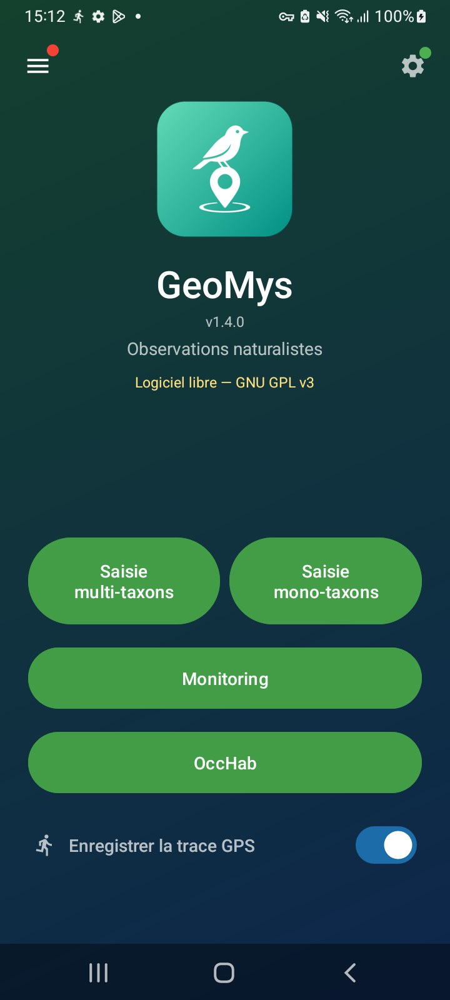
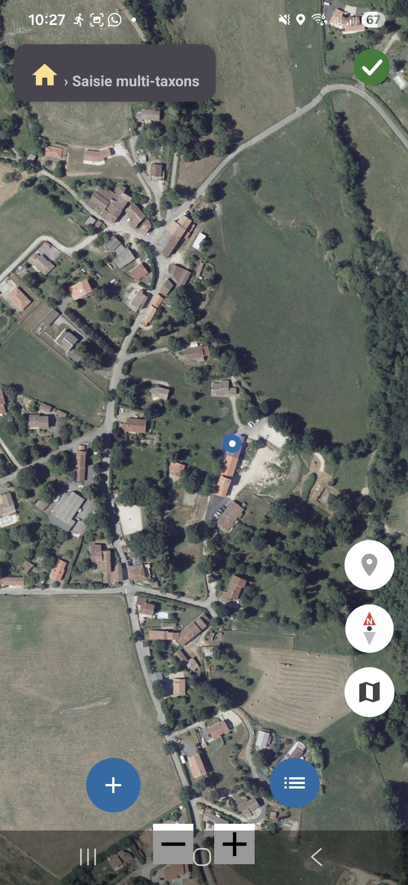
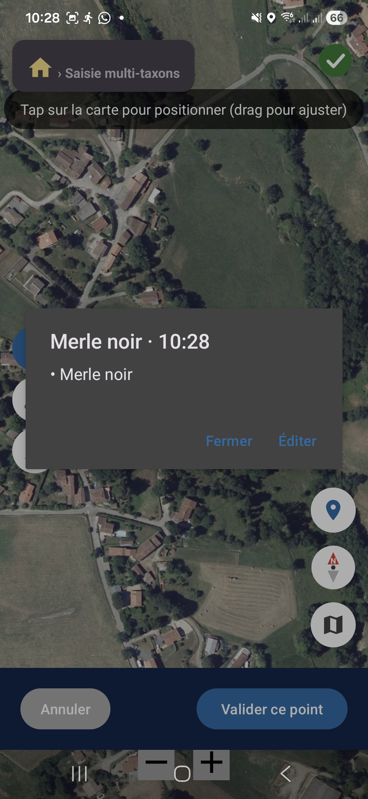
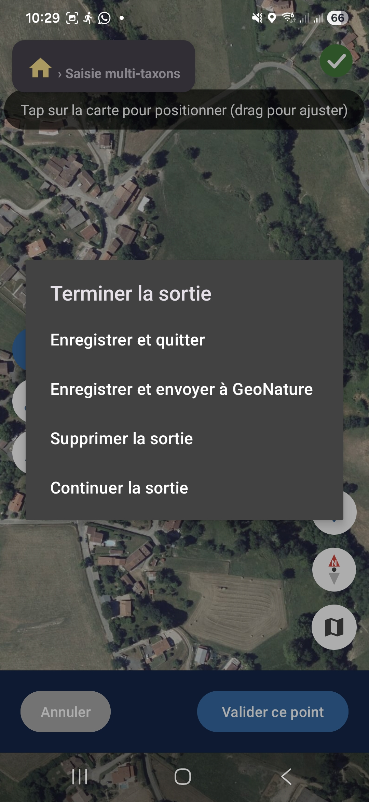

# GeoMys — Mode d'emploi

Application Android de terrain pour la saisie naturaliste connectée à un serveur [GeoNature](https://github.com/PnX-SI/GeoNature). Ce guide couvre la prise en main et l'utilisation au quotidien.

<p align="center">
  
  
  
  
</p>

---

## 1. Installation

### Prérequis
Aucun compte spécifique n'est à créer : l'application s'utilise avec un compte **GeoNature** existant.

### Méthode recommandée : Play Store
1. Ouvrir la fiche de l'application : [GeoMys sur le Play Store](https://play.google.com/store/apps/details?id=fr.ariegenature.public.geomys&hl=fr)
2. Appuyer sur **Installer**.

### Méthode alternative : installation manuelle (APK)
À réserver aux utilisateurs qui ne peuvent pas passer par le Play Store ou qui souhaitent une version précise.

1. Télécharger l'APK :
   - [Dernière version](https://github.com/ANA-CEN-Ariege/GeoMys-android/releases/latest/download/app-github-release.apk) (téléchargement direct)
   - ou choisir le fichier `app-release.apk` sur la page [Releases GitHub](https://github.com/ANA-CEN-Ariege/GeoMys-android/releases)
2. Si Android le demande, autoriser l'installation d'applications depuis des **sources inconnues** pour le navigateur ou le gestionnaire de fichiers utilisé.
3. Ouvrir le fichier APK téléchargé, puis appuyer sur **Installer**.

## 2. Première configuration

À la première ouverture, taper sur l'icône **engrenage ⚙️** en haut à droite.

### a. Connexion au serveur

| Champ | Valeur |
|---|---|
| URL du serveur | (L'URL de votre serveur GeoNature, exemple : https://geonature.ariegenature.fr/geonature) |
| Identifiant | (Votre nom d'utilisateur GeoNature) |
| Mot de passe | (votre mot de passe GeoNature) |

Taper **Connexion** : la coche verte indique que le serveur répond et que vos identifiants sont reconnus.

### b. Charger les données

Une fois la connexion validée, le bouton **Charger les données** apparaît. Il télécharge en une seule passe :

- la liste des **jeux de données** auxquels vous avez accès,
- les **listes de taxons** disponibles (biblistes TaxHub),
- les **observateurs** (membres des listes UsersHub),
- le **référentiel TaxRef** complet (noms français et scientifiques) pour l'autocomplétion,
- les **nomenclatures** (types de comptage, stades de vie, statuts, etc.),
- les **protocoles de suivi** (`gn_module_monitoring`) auxquels vous avez droit, avec leur schéma et l'arborescence de leurs sites,
- pour **OccHab** (si le module vous est ouvert) : les jeux de données du module, le référentiel **HABREF** des habitats, et **vos stations déjà enregistrées sur le serveur** — ce qui les rend consultables et modifiables hors réseau.

⏱️ Compter quelques minutes selon la taille du serveur et la qualité de la connexion. À refaire périodiquement au cas où y a eu des changements côté serveur. Les taxons ne sont rechargés que si nécessaire (changement de version).

### c. Choisir les valeurs par défaut

Trois listes déroulantes apparaissent une fois le chargement terminé :

- **Jeu de données** — celui sur lequel vos saisies OccTax seront rattachées.
- **Liste de taxons** — restreint la liste des espèces autorisées. Si le jeu de données impose une liste, elle est automatiquement sélectionnée et verrouillée.
- **Observateur par défaut** — votre nom : pré-rempli dans toutes les saisies.

### d. Panneau « Données en cache »

Affiche l'état des données présentes **dans le téléphone** :

```
Taxons           K     [ Détails ]
Nomenclatures    M
Listes           L
Observateurs     O
Protocoles       N          (si accès aux protocoles)
Stations OccHab  S          (si accès à OccHab)
```

Les deux dernières lignes **suivent vos droits** : elles n'apparaissent pas pour un compte qui n'a pas le module correspondant. Le panneau reste **consultable sans réseau** dès que des données ont été chargées.

Le bouton **Détails** ouvre la liste des groupes taxonomiques (Oiseaux, Mammifères, …) avec leur effectif filtré par la liste sélectionnée. Un tap sur un groupe affiche la liste complète des taxons.

Le bouton **Vider le cache** efface les données locales (à n'utiliser qu'en cas de problème — il faudra resynchroniser).

Valider en haut à droite avec la **coche verte** : la configuration est sauvegardée.

---

## 3. Écran d'accueil

Jusqu'à quatre entrées principales :

- **Saisie multi-taxons** — relevés OccTax pour plusieurs taxons.
- **Saisie mono-taxon (« rapide »)** — relevés éclair pour un taxon.
- **Monitoring** — accès aux protocoles de suivi.
- **OccHab** — relevés d'habitats : une **station** (point ou polygone) et les **habitats** qui s'y trouvent.

### Pourquoi l'accueil diffère d'un compte à l'autre

L'accueil n'a pas la même allure pour tout le monde, et ce n'est pas un réglage de l'app : elle **reflète ce que le serveur lui répond**. Deux raisons se cumulent :

1. **GeoNature est modulaire** — le suivi de protocoles (`gn_module_monitoring`) et les relevés d'habitats (OccHab) sont **optionnels**. Sur une instance qui ne les installe pas, il n'y a rien à proposer.
2. **Les droits sont attribués compte par compte** (CRUVED) — même quand le module existe, l'administrateur décide qui le consulte et qui y saisit.

L'app **masque** ce à quoi le compte n'a pas droit plutôt que de le griser : un bouton qui mènerait à un refus (403) du serveur n'aide personne.

| Entrée | Condition d'affichage |
|---|---|
| **Saisie multi-taxons** / **mono-taxon** | toujours — la saisie OccTax est le socle de l'app |
| **Monitoring** | accès à **au moins un protocole** (CRUVED lecture sur le module) |
| **OccHab** | module **OccHab** présent sur l'instance **et** droit de **création** de stations |

Trois configurations typiques : saisies OccTax seules ; saisies + Monitoring ; saisies + Monitoring + OccHab. Le **menu burger** et les compteurs du panneau de cache suivent exactement la même règle. Changer de serveur peut donc changer l'accueil sur le même téléphone.

Ces droits sont relevés **pendant « Recharger les données »**, pas en continu : après une correction côté GeoNature, il faut **relancer un chargement** pour que le bouton apparaisse.

*(Les trois écrans sont illustrés dans le [guide écran par écran](GUIDE_ECRANS.md).)*

**Menu burger** (en haut à gauche) — mêmes conditions que les boutons :

- **Mes saisies** — sorties OccTax enregistrées en attente d'envoi.
- **Mes visites** — saisies monitoring en attente d'envoi. *(Affiché avec l'accès aux protocoles.)*
- **Mes stations** — relevés d'habitats OccHab en attente d'envoi. *(Affiché avec l'accès à OccHab.)*
- **Explorer** — affichage sur la carte des relevés enregistrés sur le serveur GeoNature dans la dernière année.
- **Maps Manager** — téléchargement de fonds de carte pour usage hors réseau.

Une **pastille rouge** sur une entrée signale qu'il reste des données à envoyer.

**Enregistrer la trace GPS**

Quand cet interrupteur est activé, une saisie multi-taxons permet de démarrer l'enregistrement de la trace GPX du parcours.

---

## 4. Saisie multi-taxons (OccTax)

### Démarrer une sortie

Cliquez sur **Saisie multi-taxons** → la 1ère fois après l'installation, l'app demande la permission de localisation (à accepter pour l'enregistrement du parcours).

Si "Enregistrer la trace" est activée sur l'écran d'accueil, vous pouvez démarrer la trace de votre déplacement avec le bouton "Play".

Cliquer sur **➕** pour démarrer les saisies.

Pour positionner une localisation, vous pouvez soit utiliser votre position GPS, soit, en tapant sur la carte positionner un point GPS.

Cliquer sur **Valider ce point** pour séléctionner la position.

L'écran **Nouveau relevé** permet de sélectionner une ou plusieurs espèces, soit par leur nom français, soit par leur nom scientifique.

Tapez quelques lettres, et l'autocomplétion vous proposera une liste de taxons.

Les taxons proposés dépendront du groupe selectionné (bandeau défilant avec les icones des groupes) : oiseaux, Mammifères, reptiles, amphibiens, mollusques, poissons, insectes, autres invertébrés, flore, champignons.

Chaque observation est listée avec à droite 3 boutons : "Dénombrement", "Caractérisation" et "Supprimer".

### Dénombrement

Ce formulaire vous permet d'indiquer le nombre d'individus ainsi que d'autres informations (objet du dénombrement, type de dénombrement, stade de vie, sexe) . Il permet également d'ajouter une ou plusieurs photos ou des enregistrements sonores.

### Caractérisation

Ce formulaire vous permet de préciser des informations sur l'obervation : technique d'observation, état biologique, ...

### Terminer une sortie

A la fin du retevé, cliquez sur la coche verte en haut à droite pour revenir sur la carte précédente.

Sur cette carte, vous pouvez soit faire un nouveau relevé, soit terminer la sortie avec la coche verte en haut à droite.

Les sorties, avec leurs relevés, sont automatiquement enregistrées. Vous pouvez les retrouver à partir de l'écran d'accueil, dans le menu burger en haut à gauche, dans "Mes saisies". À ce stade rien n'est encore envoyé au serveur.

### Envoyer

Dans **Mes saisies** :

1. Choisir la sortie à envoyer.
2. Vérifier le récap (taxons, photos, parcours).
3. Cliquez sur la flèche verte → l'app pousse vers le serveur puis chaque média.

Si la connexion tombe pendant l'envoi, la sortie reste en local — il suffit de relancer plus tard.

### Export GPX

Depuis le détail d'une sortie : bouton **Exporter** → fichier `.gpx` partageable (mail, Drive, etc.).

---

## 5. Saisie rapide (mono-taxon)

Permet de saisir des observations multiple d'un seul taxon.

1. Taper **Saisie mono-taxon** sur l'écran d'accueil.
2. Sélectionnez l'espèce et cliquez sur "Démarrer la saisie".
3. la carte s'affiche et vous pouvez localiser une obs soit en utilisant votre position GPS soit en sélectionnant une position par un tap sur la carte.
4. Cliquez sur "+" pour valider.
5. Vous pouvez continuer à enchainer la saisie d'autre obs ou terminer en cluqant sur la coche verte en haut à droite.

Comme pour les saisies multi-taxons, ces saisies sont enregistrées au fil de l'eau et vous pourrez les retrouver dans "Mes saisies".

---

## 6. Monitoring

Ce bouton n'est visle uniquement si vous avez les droits nécessaires sur au moins un protocole.

### Liste des protocoles

Taper **Monitoring** sur l'accueil. La liste affiche uniquement les protocoles auxquels **votre compte** a droit.

> 💡 Si tu n'as accès à aucun protocole, le bouton **Monitoring** et l'entrée **Mes visites** du menu burger disparaissent automatiquement — la place est laissée aux deux saisies OccTax.

Pour chaque protocole : icône **ℹ️** (fiche) ou **🗺️** (carte de tous les sites du protocole).

### Fiche d'un protocole

La fiche liste les **sites** (ou groupes de sites) avec leur nom et leurs propriétés clés. Pour chaque ligne :

- **ℹ️ Détails** — drill dans le site (sa fiche, ses visites/observations).
- **🗺️ Carte** — affiche la géométrie du site et de ses points d'écoute / sous-objets.
- **➕** — démarre directement une saisie (visite ou observation selon le schéma) sur ce site. Ne s'affiche que pour les objets pour lesquels on eput créer une visite, un passge, etc.

### Navigation par fil d'Ariane

En haut de chaque écran de suivi : un **fil d'Ariane cliquable**
`Suivis › Protocole › Site › Point › …` permettant de remonter à n'importe quel niveau.

### Carte interactive

Sur la carte d'un protocole ou d'un site, **un tap sur un marker / polygone** ouvre un dialog qui propose :

- **Voir la fiche** de l'objet cliqué,
- **Nouvelle visite** (visite, passage, observation, …) si le protocole le permet.

Le fil d'Ariane qui en résulte respecte la hiérarchie réelle de l'objet, quel que soit le chemin emprunté pour arriver à la carte.

### Formulaire de saisie dynamique

Les formulaires sont **construits à la volée** depuis le schéma du protocole envoyé par le serveur. L'app couvre 10 widgets : texte, nombre, date, heure, case à cocher, listes (simple / multiple), radios, et taxon (autocomplétion TaxRef).

Spécificités :

- les **champs obligatoires** sont signalés par `*` ; le bouton **Enregistrer** reste désactivé tant qu'ils ne sont pas remplis.
- les **bornes min/max** numériques sont vérifiées en direct (message d'erreur sous le champ).
- les **masquages conditionnels** déclarés par le schéma sont respectés (ex : un champ « comportement » qui n'apparaît que si « observation directe » est cochée).
- les **valeurs par défaut** du serveur sont pré-renseignées.
- les **règles `change`** (auto-remplissage de champs dépendants) sont appliquées au fil de la saisie.

### Enchaînement

Après la création d'une visite, l'app propose directement de créer l'observation enfant — pas besoin de retourner à la liste pour le « + » suivant.

### Informations de fin de visite

Certains protocoles imposent des champs qu'on ne connaît **qu'à la fin** de la visite (heure de fin, température de fin, durée). Il n'est donc pas nécessaire de les inventer au départ :

- la visite s'enregistre **sans eux**, marquée **à compléter** ;
- au moment de **Terminer**, l'app propose de la compléter ;
- tant qu'un champ obligatoire manque, elle **ne part pas** au serveur : dans *Mes visites*, sa flèche d'envoi est **rouge** et la toucher ouvre le formulaire sur les champs restants, chacun signalé par une **barre rouge**.

Cela ne vaut que pour les **informations générales de la visite**. Une saisie d'**espèce** reste bloquée tant que ses champs obligatoires ne sont pas remplis.

### Saisies en attente

Écran **Mes visites** (menu burger), regroupé par protocole et par site. Le compteur en tête ne totalise que les **visites** (ou passages, transects…), pas les espèces qu'elles contiennent.

L'**envoi est manuel** (jamais automatique) : vous choisissez explicitement quand pousser au serveur, visite par visite ou d'un bloc avec **Tout envoyer**. Une visite incomplète est écartée de l'envoi — les autres du lot partent normalement.

---

## 7. OccHab (relevés d'habitats)

Le module **OccHab** décrit *où* l'on se trouve — une **station**, point ou polygone — et *quels habitats* s'y trouvent. Accessible depuis la tuile **OccHab** de l'accueil, si le module et le droit de création sont accordés.

### Démarrer un relevé

Un formulaire **Informations obligatoires** s'ouvre dès la carte : jeu de données, observateurs, dates de début et de fin, nature de l'objet géographique. Il est **pré-rempli avec le relevé précédent** (les dates repartent du jour) — en général, il n'y a qu'à valider.

L'interrupteur **« Afficher mes stations déjà sur GeoNature »** est **coché par défaut** : la carte fait alors apparaître vos stations déjà envoyées. Le décocher est mémorisé pour les relevés suivants ; la carte se centre alors sur votre position.

### Dessiner une station

- **Point** : toucher la carte. **Polygone** : toucher pour poser les sommets (3 minimum).
- **Appui long** sur un sommet pour le déplacer ; **poignée +** au milieu d'une arête pour y insérer un sommet.
- Un sommet posé près d'un sommet existant s'y **aimante**. Ensuite, déplacer ce sommet commun déplace **les deux** polygones : les limites restent jointives.
- **Annuler** défait la dernière opération (sommet ajouté, déplacé, inséré), effet sur le polygone voisin compris.
- La **surface** est calculée automatiquement (localement, donc hors réseau) et les **altitudes** min/max sont remplies depuis le MNT du serveur quand il y a du réseau.

### Reprendre une station du serveur

Vos stations déjà envoyées apparaissent en **violet**. En toucher une propose de l'ouvrir dans le relevé en cours : géométrie et habitats deviennent modifiables, et l'envoi repartira en **mise à jour** de la station existante — jamais en doublon.

- Une station n'entre dans **Mes stations** qu'à partir du moment où elle est **réellement modifiée**. La consulter ne crée rien ; annuler toutes les modifications l'en fait ressortir.
- Une station déjà reprise dans une **autre** saisie apparaît en **orange pointillé** : la toucher propose d'ouvrir cette saisie. Il n'existe jamais deux copies locales d'une même station serveur.
- Ces stations sont mises en cache au chargement des données : elles s'affichent et se modifient **sans réseau** (l'app indique la date du dernier chargement).
- Une station dessinée sous QGIS peut comporter un **trou** (polygone intérieur) : il s'affiche en creux, ses sommets se modifient comme les autres, et il est **conservé** au renvoi.
- Une géométrie **multi-parties** est affichée mais non modifiable dans l'app : la retoucher sous QGIS.

### Habitats

Après validation de la géométrie, on décrit le ou les habitats : **habitat HABREF** (autocomplétion **hors ligne**, restreinte à la liste du module), déterminateur, type de détermination, technique de collecte, recouvrement en %, abondance…

Une station peut être **enregistrée et envoyée sans habitat** ; les habitats se complètent plus tard.

Sur les stations issues du **plugin QGIS de l'ANA**, une section **Évaluation ANA / Natura 2000** apparaît en plus (enjeu, état de conservation, typicité, plantes exotiques envahissantes…). Elle est modifiable, et le reste du commentaire n'est jamais altéré.

### Envoi

Écran **Mes stations** (menu burger) : relevés classés *à envoyer* / *envoyées*, avec le nombre de stations. L'envoi est **manuel**, relevé par relevé ou via **Tout envoyer**. Supprimer un relevé n'efface que la copie locale — rien n'est supprimé sur GeoNature.

---

## 8. Cartographie

Quatre fonds disponibles, basculables au tap sur l'icône en haut à droite de la carte :

- **OSM** — OpenStreetMap (généraliste).
- **IGN Topo** — fond topo IGN.
- **IGN Scan25** — cartes au 1:25 000 (terrain).
- **IGN Ortho** — orthophotos.

### Cache hors-réseau

Pour préparer une sortie sans couverture :

1. Menu burger → **Cache Manager**.
2. Choisir un protocole pour pré-cadrer sur ses sites, ou définir une zone manuellement.
3. Sélectionner le **fond** (à télécharger un seul à la fois) et le **zoom maximum** (jusqu'à 17 — équivaut au 1:18000).
4. Taper **Télécharger**.

⚠️ Limites :

- Surface maximale : ~200 km² par téléchargement.
- Plafond global : 1 Go par fond — au-delà, purge automatique LRU (= les tuiles les moins consultées sont supprimées).

---

## 9. Mode offline

L'app fonctionne **entièrement hors-réseau** une fois les données chargées :

- liste des protocoles, fiches, schémas — depuis le cache local,
- saisies — stockées en local, taggées comme « en attente d'envoi »,
- cartes — depuis les tuiles téléchargées,
- autocomplétion taxon — depuis le cache TaxRef,
- OccHab — habitats HABREF et **vos stations déjà sur le serveur**, depuis le cache.

Quand la connexion revient, les saisies en attente restent en local jusqu'à ce que **vous** lanciez explicitement l'envoi.

---

## 10. Cas particuliers et dépannage

### « Aucun protocole accessible »

Vous voyez ce message si le compte n'a aucun droit CRUVED sur les protocoles de l'instance. Vérifier côté GeoNature que les rôles attribués couvrent au moins la lecture sur les modules visés.

### Un bouton attendu n'apparaît pas sur l'accueil

**Monitoring** et **OccHab** ne s'affichent qu'avec les droits correspondants (cf. § 3). Les droits sont relevés pendant **Recharger les données** : après une correction côté GeoNature, il faut donc **relancer un chargement** pour que le bouton apparaisse. Même chose pour les entrées *Mes visites* / *Mes stations* du menu et pour les compteurs du panneau de cache.

### L'app exige un rechargement des données après une mise à jour

Certaines versions modifient le format des données mises en cache. Au premier lancement, l'app ouvre alors **Configuration** et demande un **Recharger les données** avant de laisser continuer. **Les saisies en attente sont conservées** (Mes saisies, Mes visites, Mes stations) et restent envoyables ensuite.

### Synchronisation incomplète

Si le bandeau de sync indique « étape(s) en échec », c'est qu'au moins un endpoint a renvoyé une erreur. On peut **relancer** sans tout perdre — les étapes réussies ne sont pas refaites tant que tu ne videras pas le cache.

### Le serveur a changé de version TaxRef

Un bandeau orange en haut de l'écran de config signale `TaxRef serveur v17 — cache v16`. Re-cliquer sur **Recharger les données** pour mettre à jour.

### Liste de taxons absente du cache

Si tu choisis un `id_liste` qui n'a pas été synchronisé, un avertissement orange apparaît. **Recharge les données** : le sync télécharge alors toutes les listes serveur, y compris la nouvelle.

### Une saisie monitoring partielle est-elle envoyable ?

Oui — l'auto-save crée un brouillon en `PENDING` dès le début de la saisie. Tu peux quitter et revenir : l'observation partielle est récupérée. Attention : si tu **envoies** une saisie partielle, le serveur la considèrera comme complète (à elle de te valider ou non selon ses contraintes).

### Photos manquantes après envoi ?

Vérifier le détail de la sortie côté serveur. Si une photo est marquée comme « envoyée » côté app mais absente serveur, c'est typiquement un timeout HTTP pendant le PUT. Recharger la sortie en local puis renvoyer.

---

## 11. Configuration avancée

### Champs additionnels

Si le serveur expose des `additional_fields` pour OCCTAX, ils sont automatiquement intégrés au formulaire de saisie multi-taxons.

### Changement de serveur ou de compte

Retour à **Configuration** → modifier URL / identifiants → **Connexion** → **Recharger les données**.

⚠️ Avant de changer de compte, **vider le cache** pour éviter que des données du précédent utilisateur ne traînent en local.

---

## Releases & versions

Chaque version est publiée sur la page [Releases GitHub](https://github.com/ANA-CEN-Ariege/GeoMys-android/releases) avec un **APK signé** attaché, et sur le **Play Store**. La version installée est visible sur l'écran d'accueil (en bas) et dans **Configuration**.

⚠️ Les deux canaux sont des **applications distinctes** : passer de l'un à l'autre impose de désinstaller la précédente — donc d'**envoyer ses saisies en attente avant**. Sur la version Play, les mises à jour viennent du Store (toucher le numéro de version n'ouvre pas d'écran de mise à jour).

---

## Support

Pour signaler un bug ou demander une évolution : ouvrir une issue sur [le dépôt GitHub](https://github.com/ANA-CEN-Ariege/GeoMys-android/issues).

© ANA - CEN Ariège
