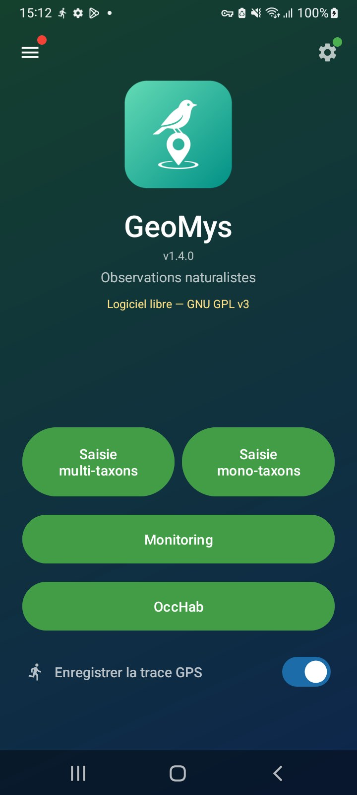
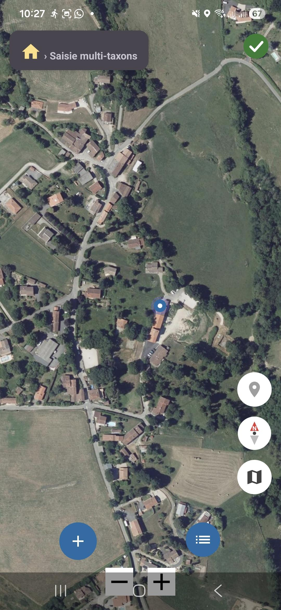
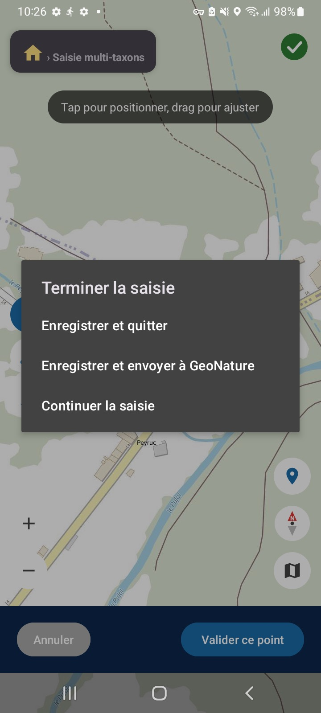
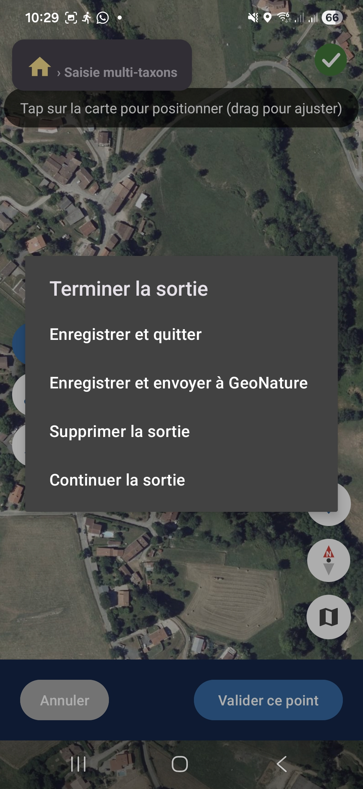

# GeoMys Android

GeoMys est une application mobile Android alternative à Occtax-mobile (https://github.com/PnX-SI/gn_mobile_occtax/) et Monitoring-mobile (https://github.com/RNF-SI/gn_mobile_monitoring). Elle permet une saisie naturaliste sur un serveur [GeoNature](https://github.com/PnX-SI/GeoNature), en ligne comme hors-ligne.

Elle permet de saisir des observations naturalistes dans le module Occtax en enchainant les relevés mono ou multi-taxons avec suivi GPS de la localisation, puis de les envoyer vers le module Occtax du serveur GeoNature auquel elle est connectée.

Elle permet de saisir des visites et des observations dans les sous modules monitorings, puis de les envoyer vers le module Monitorings du serveur GeoNature auquel elle est connectée.

Elle permet de saisir des stations d'habitats dans le module OccHab — géométrie point ou polygone dessinée sur la carte, habitats du référentiel HABREF — ainsi que de reprendre et mettre à jour les stations déjà présentes sur le serveur.

Elle permet de consulter les observations récentes présentes dans le serveur GeoNature auquel elle est connectée (profondeur d'historique pilotée par le serveur, 365 jours par défaut).

Développée par l'[ANA - CEN Ariège](https://ariegenature.fr/).

<p align="center">
  
  
  
  
</p>

👉 **Documentation utilisateur** :
- [`MODE_EMPLOI.md`](MODE_EMPLOI.md) — prise en main, workflows terrain et cas particuliers.
- [`GUIDE_ECRANS.md`](GUIDE_ECRANS.md) — guide illustré, écran par écran (également disponible en PDF).
- [`NOTES-VERSIONS.md`](NOTES-VERSIONS.md) — nouveautés regroupées par thème.

## Installation

Deux canaux de distribution, construits depuis le même code (product flavors `github` et `play`) :

| Canal | applicationId | Artefact | Mise à jour |
|---|---|---|---|
| GitHub | `fr.ariegenature.geomys` | APK release **signé**, attaché à chaque [release](https://github.com/ANA-CEN-Ariege/GeoMys-android/releases) (tag `vX.Y.Z`) | écran de mise à jour intégré à l'application |
| Play Store | `fr.ariegenature.public.geomys` | `.aab` déposé sur la console Google Play | gérée par le Store |

Les deux `applicationId` étant distincts, **les deux applications cohabitent sur un même téléphone avec des données séparées** : envoyez vos saisies en attente avant de changer de canal. Le `versionCode` est commun et strictement croissant pour les deux canaux.

Un compte sur une instance GeoNature est nécessaire.

## Fonctionnalités principales

### Saisie libre (OccTax)
- **Suivi GPS** en arrière-plan via service foreground, tracé du parcours sur carte.
- **Saisie multi-taxons** géolocalisée : un relevé peut contenir plusieurs occurrences (taxons, dénombrements, médias). Géométries point / ligne / polygone au doigt sur la carte. À la réédition d'une sortie, les lignes et polygones sont redessinés et leurs sommets restent **déplaçables** (un tap sur la forme ouvre la liste des espèces du relevé). Après validation d'un relevé, la carte repasse **directement en mode positionnement** pour enchaîner le relevé suivant.
- **Saisie rapide mono-taxon** : ouverture instantanée, photo + taxon + envoi en quelques tap.
- **Champs additionnels** : si le serveur en déclare (OCCTAX_RELEVE, OCCTAX_OCCURRENCE, OCCTAX_DENOMBREMENT), l'application les gère au niveau du relevé, de l'occurrence ou du dénombrement, dans les deux modes de saisie.
- **Saisie d'espèce — l'ensemble des noms acceptés est exactement l'ensemble des noms proposés.** Le périmètre est le groupe taxonomique choisi, la liste de taxons configurée **et** le mode d'affichage ; un nom qui n'a pas été proposé est refusé explicitement (« Nom invalide — choisissez parmi les propositions ») plutôt qu'enregistré au jugé. Chaque proposition s'affiche sur **deux lignes** — le nom choisi, puis son nom scientifique (ou français) en dessous — si bien que deux espèces portant le même nom vernaculaire restent distinguables, chacune sur sa ligne. Un switch **« Noms scientifiques »** bascule le mode d'affichage ; il est mémorisé et partagé entre les deux écrans de saisie. Le texte déjà tapé survit au changement de groupe comme au changement de mode.
- **Résolution purement locale** : depuis la v1.4.3, plus aucun appel réseau pendant la frappe — les propositions et la résolution sortent du cache TaxRef synchronisé, donc fonctionnent hors-ligne et sans latence.
- **Indice de nidification automatique (oiseaux)** : lorsqu'une espèce d'oiseau saisie est **en période de nidification** au mois courant (référentiel embarqué `nidification_oiseaux.json`, ~285 espèces nicheuses de France), l'écran de **caractérisation s'ouvre automatiquement** en ne proposant que le champ **Comportement** — pour renseigner l'indice de nidification d'un tap, sans ouvrir tout le formulaire. L'écran reste fermable (non bloquant) ; une espèce hors période, hors référentiel ou non résolue n'a aucun effet. La valeur de Comportement choisie est **reproposée par défaut aux espèces nidificatrices suivantes**, mais **pas aux autres espèces**, qui restent à « Non renseigné ».
- **Bandeau de navigation** « 🏠 › Saisie mono-taxons / multi-taxons » présent sur tous les écrans de chaque flux de saisie (icône maison cliquable → retour à l'accueil), à l'image du fil d'Ariane des suivis.
- **Mes saisies** : les saisies OccTax sont réparties en trois onglets — « À envoyer », « Envoyées », « Importées ». Chaque saisie en attente s'édite, se supprime, s'envoie individuellement et s'exporte en **GPX** ; un GPX peut aussi être **importé**.
- **Envoi GeoNature** : POST des relevés OccTax avec occurrences, médias et géométries, avec vérification anti-doublon avant toute (re-)création.

### Stations d'habitats (OccHab)

La tuile **OccHab** de l'accueil n'apparaît que si le module est installé sur le serveur et que l'utilisateur a le droit d'y créer des stations.

- **Géométrie dessinée sur la carte** : mode **point** (un point déplaçable) ou **polygone** (un tap ajoute un sommet, chaque sommet se déplace au doigt, une poignée « + » au milieu de chaque arête y insère un sommet). « Annuler » revient sur la **dernière opération** — tap, déplacement, insertion — propagation aux polygones voisins comprise.
- **Aimantage et topologie partagée** : un point ou un sommet posé s'aimante au sommet le plus proche parmi les stations de la session et les stations serveur affichées ; un sommet partagé par deux polygones mitoyens suit les deux dès le dessin, ce qui évite les interstices entre stations contiguës.
- **Polygones à trou** : les anneaux intérieurs d'une station tracée sous QGIS sont lus, dessinés en creux, **éditables sommet par sommet** et **renvoyés tels quels** à la mise à jour — sans quoi un simple ré-envoi les supprimait côté serveur. L'application ne crée pas de trou.
- **Surface et altitudes** : à la validation de la géométrie, la surface est calculée **localement** (donc hors-ligne), trous déduits, et les altitudes min/max sont demandées au MNT du serveur quand il y a du réseau. Les deux restent corrigeables à la main.
- **Habitats HABREF** : de 0 à N habitats par station (une station sans habitat reste valide et envoyable), avec nom cité, déterminateur, recouvrement, technique de collecte et nomenclatures. L'autocomplétion lit un **cache HABREF local**, restreint à la liste déclarée par le module quand le serveur en publie une.
- **Stations déjà sur GeoNature** : vos stations du serveur s'affichent sur la carte, cadrent la vue et servent de cibles d'aimantage. Les toucher les **importe pour modification** — géométrie et habitats — et l'envoi part en **mise à jour** de la station existante, jamais en doublon. Une station n'entre dans « Mes stations » qu'à la **première modification réelle** ; si l'on annule toutes ses modifications, elle en ressort. Il ne peut jamais y avoir plus d'une copie locale non envoyée par station serveur.
- **Évaluations ANA / Natura 2000** : les stations portant un bloc `[ANA-EVAL]` (plugin QGIS maison) affichent une section éditable (statut, enjeu, état de conservation, zone humide, unité végétale…). Le texte libre du commentaire n'est jamais altéré : le bloc est extrait à la lecture et refusionné à l'envoi.

### Suivis protocolés (`gn_module_monitoring`)
- **100 % schema-driven** : aucun protocole en dur. L'app parse `/api/monitorings/config/<module>` et construit dynamiquement formulaires, fils d'Ariane et navigations selon l'arborescence du protocole (`sites_group → site → visit → observation`, `zone → station → point`, etc.).
- **Form renderer dynamique** : 13 types de champs — TEXT, TEXTAREA, NUMBER, DATE, TIME, DATETIME, TAXON, SELECT, RADIO, SELECT_MULTIPLE, CHECKBOX, CHECKBOX_MULTIPLE, MEDIA (photos multiples). Pré-remplissage des valeurs par défaut serveur, masquage conditionnel via la clé `hidden` du schéma (booléen ou expression Angular-like), auto-remplissage de champs dépendants via les règles `change`. Les champs **date / heure / datetime** sans défaut serveur sont initialisés à la **date du jour et l'heure actuelle** (le défaut serveur reste prioritaire ; en édition les valeurs saisies sont conservées) — vaut pour les formulaires monitoring comme pour les champs additionnels OccTax.
- **Champ espèce** : les suggestions sont restreintes à la liste taxonomique du protocole et, comme en OccTax, **seuls les noms proposés sont acceptés** ; le taxon retenu est affiché sous le champ. La résolution se fait sur le cache local, donc hors-ligne.
- **Photos rattachées aux objets monitoring** : plusieurs photos par objet, choisies dans la galerie **ou prises directement avec l'appareil** ; chacune est uploadée vers `gn_commons` après création de l'objet (uuid pré-généré côté client comme `uuid_attached_row`).
- **Datalists** : préchargées par la synchronisation (observateurs, nomenclatures, datasets…) pour fonctionner hors-ligne, et fetchées à la volée depuis les endpoints déclarés par le schéma lorsqu'elles manquent.
- **Filtrage CRUVED** : la liste UI, le cache disque et la synchronisation offline ne retiennent que les modules sur lesquels l'utilisateur authentifié a au moins un droit > 0 (parité gn_mobile_monitoring) — le bloc `cruved` retourné par `/api/monitorings/modules` est appliqué dès le parsing, avant toute autre opération ou réécriture cache.
- **Carte interactive** : sur la carte d'un protocole ou d'un site, un tap sur un marker / polyline / polygone ouvre un dialog qui affiche le nom de l'objet et propose les actions disponibles selon le schéma (voir la fiche, démarrer une nouvelle saisie).
- **Validation** : le bouton Enregistrer est désactivé tant qu'un champ numérique viole ses bornes `min`/`max` (littérales ou pointant vers un autre champ, message d'erreur inline) ou qu'un champ obligatoire visible reste vide. **Exception assumée pour les informations générales d'une visite** : un champ obligatoire manquant n'y bloque plus l'enregistrement (demande terrain), la visite est enregistrable **incomplète**, les champs manquants sont signalés par des barres rouges et un rappel de fin de visite indique ce qui reste à compléter.

### Explorer
Consultation cartographique des observations récentes du serveur (`synthese`) : requête sur l'emprise visible, regroupement en clusters, icône par groupe taxonomique, et fiche détaillée au tap. La profondeur d'historique est celle publiée par le serveur (365 jours par défaut).

### Mode offline complet
- **Outbox local** des saisies monitoring (visites + observations) : stockage JSON write-through, lien parent → enfant via UUID local quand le parent n'a pas encore d'id serveur.
- **Envoi à la demande** uniquement (jamais automatique) — écran « Mes visites » avec un fil d'Ariane par groupe (`Site : Forêt de Foix › Station : Point Foix-Nord`), édition / suppression cascade / envoi par groupe.
- **Saisies OccHab** enregistrées au fil de l'eau (« Mes stations ») et envoyées à la demande ; les **stations serveur** et le **référentiel HABREF** sont mis en cache par « Charger les données », donc disponibles sans réseau (avec la date du dernier chargement).
- **Cache des fonds de cartes** : écran « Maps Manager » qui télécharge une zone (jusqu'à 200 km², zoom 17) pour un usage terrain sans réseau. Plafond 1 Go avec purge LRU automatique. Cible un protocole pour cadrer + afficher les géométries de ses sites macro.
- **Fonds hors-ligne importés** : un fichier **MBTiles** fourni par l'utilisateur peut être importé et utilisé comme fond de carte, sans aucun réseau.
- **Cache des fiches monitoring** : modules, schémas, fiches d'objets et listes d'enfants conservés en local pour le drill-down hors-ligne. Le préchargement couvre les objets **structurels** (groupes de sites, sites, points…) ; les objets de saisie eux-mêmes (visites, observations déjà enregistrées sur le serveur) ne sont pas aspirés.

### Cartographie
Six fonds en ligne, basculables au tap : **OSM**, **OpenTopoMap**, **IGN Topo** (PLANIGNV2), **IGN Scan25**, **IGN Ortho**, **Esri Imagery** — auxquels s'ajoutent les fonds **MBTiles** importés par l'utilisateur.

Le dernier fond choisi est **mémorisé** et réappliqué à l'ouverture de n'importe quelle carte (préférence partagée entre tous les écrans).

**Position courante & GPS externe** : tous les écrans-carte affichent la position en direct et peuvent s'y recentrer. L'app lit le `LocationManager` standard d'Android : un récepteur externe (ex. **RTK** relayé par **SW Maps** en « position fictive » / mock location) est donc utilisé de façon transparente, sans configuration côté app.

## Limitations connues

Volontairement hors périmètre à ce stade. Pour le module monitoring, le périmètre cible reste **consultation + visites + saisies sur sites existants** — pas de création de sites.

- **Saisie de géométrie au formulaire monitoring (widget `geometry`)** — non portée. Les champs de type `geometry` sont **dégradés en champ texte**. La *consultation* des géométries de sites existants, elle, est pleinement supportée (carte interactive, « Maps Manager »).
- **Médias OccHab** — une station ou un habitat OccHab ne porte **ni photo ni média**, contrairement à OccTax et au monitoring.
- **Géométries OccHab non modélisées** — l'application ne dessine qu'un point ou un polygone. Une station serveur en ligne, MultiPoint ou GeometryCollection n'est pas affichée et est signalée à part dans le message de chargement ; un MultiPolygon à plusieurs parties est affiché mais non importable (le renvoyer supprimerait les autres parties).
- **Datalists TaxHub** — seules les listes alimentées par une application `GeoNature` sont chargées dynamiquement ; les datalists pointant vers **TaxHub** ne sont pas encore récupérées.
- **Dictée vocale** — disponible sur le champ espèce de la saisie OccTax uniquement (pas dans les formulaires monitoring), en français, sans choix de langue.
- **Expressions de formulaire hors grammaire** — les expressions `hidden` / `change` / validation qui sortent de la grammaire reconnue sont ignorées (champ affiché et modifiable) plutôt que mal interprétées.
- **Pas de tests instrumentés UI** — la couverture automatique est solide côté logique (parsing schéma, payloads, flux réseau, offline, stores) mais il n'existe aucun test d'interface ; la validation de ces parcours reste manuelle.

## Configuration GeoNature

Écran de configuration (icône engrenage en haut à droite) :

| Paramètre | Description |
|-----------|-------------|
| URL du serveur | URL de base du serveur GeoNature (ex : `https://geonature.example.org`) |
| Identifiant / Mot de passe | Identifiants de connexion GeoNature (mot de passe chiffré sur l'appareil) |
| Jeu de données | Sélection dans la liste ou saisie de l'`id_dataset` |
| Liste de taxons | Liste TaxHub pour l'autocomplétion OccTax (`id_liste`) |
| Observateur par défaut | Observateur pré-sélectionné sur les relevés |

Le bouton **Tester la connexion** vérifie les identifiants, affiche la version de l'instance et **révèle la section de chargement** — il ne télécharge rien par lui-même. Le bouton **Charger les données** (intitulé **Recharger les données** une fois le cache rempli) télécharge le cache TaxRef + nomenclatures + datasets / listes / observateurs / champs additionnels, les modules, schémas, listes et fiches du monitoring, et, si le module OccHab est accessible, le référentiel HABREF et vos stations serveur.

**Chargement en arrière-plan.** Le chargement s'exécute dans un **service au premier plan** (`foregroundServiceType=dataSync`, notification de progression) : il **continue même si l'utilisateur quitte l'écran, met le téléphone en veille ou passe l'app en arrière-plan** — la synchro complète (souvent longue à cause de TaxRef) n'est plus interrompue. En revenant sur l'écran Config pendant l'opération, on retrouve la progression en cours ; le résultat (et un éventuel récapitulatif d'étapes en échec) s'affiche à la fin.

**Rechargement imposé après certaines mises à jour.** Quand une version change le format ou le contenu d'un cache, l'application exige un rechargement au premier lancement : elle ouvre Paramètres, affiche un bandeau et bloque la saisie jusqu'à ce que le chargement ait abouti. Les saisies en attente sont conservées et restent envoyables.

**Liste de taxons partiellement chargée.** Si la pagination d'une liste s'interrompt (réseau coupé, serveur indisponible), les taxons déjà reçus sont conservés mais le cache est marqué **incomplet** : Paramètres le signale en nommant la liste concernée et demande un nouveau chargement. Sans cela, l'application refuserait des espèces pourtant valides en mettant en cause la saisie de l'observateur.

**Garde de cohérence config (écran d'accueil).** On ne peut démarrer une saisie que si la configuration est **complète et cohérente avec le serveur courant** : connexion renseignée **et** jeu de données, liste de taxons et observateur par défaut **réellement présents dans les caches** du serveur (et non hérités d'un autre serveur, ce qui provoquait un `HTTP 500` opaque côté GeoNature — violation de clé étrangère). Tant que ce n'est pas le cas :

- une **pastille rouge** s'affiche sur le bouton ⚙️ *Paramètres* (le point vert n'apparaît qu'une fois la config valide) ;
- les tuiles de saisie restent visibles mais **grisées/désactivées** ;
- les tuiles **Monitoring** et **OccHab** n'apparaissent que si l'utilisateur a des droits sur le module correspondant.

Changer de serveur ou d'identifiants invalide les caches et les sélections qui en dépendent, pour la même raison. Le bouton **Vider le cache** purge les données synchronisées sans toucher aux saisies en attente.

À l'envoi, si le jeu de données configuré est absent du serveur, l'erreur remontée est explicite (« jeu de données introuvable sur ce serveur ») au lieu d'une « erreur serveur ».

Le panneau **Chargement des données** affiche six compteurs — **taxons** (`cd_nom` distincts), **protocoles**, **nomenclatures**, **listes**, **observateurs** et **stations OccHab** (toutes listes et tous jeux de données confondus) ; les lignes Protocoles et Stations OccHab sont masquées si l'utilisateur n'a pas les droits correspondants. Pour les taxons, un bouton **Détails** ouvre un dialog listant **tout le cache regroupé par liste**, un tap ouvrant la liste détaillée des taxons. Sous le champ **Liste**, une ligne d'info indique le nombre de taxons de la liste sélectionnée, ou un avertissement si elle est absente du cache **ou vide**.

Le chargement récupère les taxons de **toutes les listes publiques** (`/biblistes`), des **listes imposées par les datasets**, et des **listes taxonomiques des protocoles** auxquels l'utilisateur a accès (filtré CRUVED) — y compris des listes « privées » non publiées. À la saisie, l'autocomplétion d'espèce est **strictement limitée à la liste sélectionnée**.

Dans la saisie OccTax (multi et mono-taxons), le bouton **Détails** du relevé permet en outre d'**éditer le jeu de données et l'observateur** du relevé (en plus des éventuels champs additionnels) ; ces choix s'appliquent à toutes les observations de la session.

## Écran d'accueil

- **Saisie multi-taxons** — relevé OccTax complet.
- **Saisie mono-taxon** — saisie éclair.
- **Monitoring** — accès aux protocoles `gn_module_monitoring` (si droits).
- **OccHab** — saisie de stations d'habitats (si le module est installé et les droits accordés).
- Switch **Enregistrer la trace GPS** et numéro de version de l'application.
- Menu burger (**pastille rouge** sur le bouton dès qu'une saisie, une visite ou une station reste à envoyer) :
  - **Mes saisies** — saisies OccTax (À envoyer / Envoyées / Importées), export et import GPX.
  - **Mes visites** — saisies monitoring en attente d'envoi.
  - **Mes stations** — saisies OccHab en attente d'envoi.
  - **Explorer** — observations récentes du serveur sur carte.
  - **Maps Manager** — téléchargement de fonds offline.

  Chacun de ces écrans affiche le bandeau de navigation « 🏠 › <écran> » (icône maison cliquable → retour à l'accueil), comme les écrans de saisie.

## Architecture

```
app/src/main/java/fr/ariegenature/geomys/
├── GeoMysApplication.kt    # Init osmdroid, caches, outbox, purge des médias orphelins
├── TaxRefLocal.kt          # Propositions d'espèces depuis le cache TaxRef synchronisé
├── model/                  # Models.kt (Sortie, Observation, Denombrement, Taxon)
│                           # OccHab.kt (saisie, station, habitat)
├── network/                # HttpClient, GeoNatureAuth, CompatibiliteServeur, GNErreur,
│                           # SyncRunner, GeoNatureBrowse, GeoNatureSync, GeoNatureUpload,
│                           # EnvoiSortie, OutboxEnvoi, AdditionalFields, TaxRefService,
│                           # HabitatService, MonitoringApi (+ Modules / Schemas / Objets /
│                           #   Datalists / Envoi / Sync), OccHabApi, OccHabUpload, EnvoiOccHab
├── store/                  # GeoNatureConfig, MdpChiffre, CachesSynchronises, TaxRefCache,
│                           # NomenclatureCache, HabitatCache, OcctaxFieldsConfig,
│                           # NidificationOiseaux, PictoCache, MonitoringCache,
│                           # OutboxMonitoring, SortieStore, OccHabStore,
│                           # StationsServeurCache, MapTileCache, MbtilesStore
├── sync/                   # SyncForegroundService (chargement des données au premier plan)
├── monitoring/form/        # Form renderer dynamique (EditableField, FormulaireRenderer,
│                           # WidgetMapping, HiddenExpr, ChangeRules, ValidationExpr)
├── util/                   # AnaEval (blocs [ANA-EVAL] du plugin QGIS), GeoJsonCoords,
│                           # TopologiePolygone, dates
├── location/               # LocationTracker, LocationForegroundService
├── gpx/                    # Import / export GPX
└── ui/                     # Fragments : Accueil, Trace, SaisieRapide, SaisieObservation,
                            # ConfigGeoNature, Suivis, SuiviDetail, FicheObjet,
                            # CarteGeometrie, NouvelleVisite, SaisiesEnAttente, Sorties,
                            # CacheManager, Explorer, OccHabCarte, OccHabStation,
                            # OccHabHabitat, OccHabStations, StationsServeurOverlay,
                            # saisie/ (TaxonSelector, OcctaxFieldsRenderer, ChampsTaxon…)
```

Le code propre au canal GitHub (mise à jour intégrée) vit dans `app/src/github/` et est **absent** du binaire publié sur le Play Store ; `app/src/play/` n'en contient que les stubs.

- **Min SDK :** 24 (Android 7.0)
- **Compile SDK :** 37 — **Target SDK :** 36
- **Langage :** Kotlin ; bytecode cible Java 11
- **Outillage :** Gradle 9.3.1 (daemon sous Java 21, épinglé par `gradle/gradle-daemon-jvm.properties`), AGP 9.1.1
- **Architecture :** Fragment + Navigation Component, ViewBinding
- **Carte :** osmdroid (fonds OSM + IGN via Géoportail, MBTiles hors-ligne)
- **Dépendances :** version catalog `gradle/libs.versions.toml` pour l'exécution ; les dépendances de test (org.json, Robolectric, androidx.test, MockWebServer) sont déclarées dans `app/build.gradle.kts`
- **Release :** minification R8 et réduction des ressources activées ; `mapping.txt` archivé à chaque release

## Endpoints serveur utilisés

Sauf mention `<taxhub>`, toutes les routes sont relatives à l'**URL du serveur GeoNature** configurée. `<taxhub>` désigne l'URL TaxHub publiée par le serveur, à défaut `<URL_GEONATURE>/api/taxhub`.

**Authentification et configuration**

| Endpoint | Usage |
|----------|-------|
| `POST /api/auth/login` | Authentification (Flask-JWT-Extended) |
| `GET /api/gn_commons/config` | Version et configuration de l'instance, durée d'historique |
| `GET /api/gn_commons/modules` | Modules installés et droits CRUVED (détection Occtax / OccHab) |
| `GET /api/gn_commons/t_mobile_apps` | Réglages mobiles (URL TaxHub, taille de page, champs visibles) |
| `GET /api/gn_commons/additional_fields?module_code=<code>` | Champs additionnels déclarés par le serveur |

**Taxons, nomenclatures, référentiels**

| Endpoint | Usage |
|----------|-------|
| `GET <taxhub>/api/biblistes` | Listes de taxons publiées |
| `GET <taxhub>/api/taxref?…` | Taxons d'une liste (pagination) |
| `GET /api/nomenclatures/nomenclatures/taxonomy` | Nomenclatures taxonomiques (replis `…/nomenclature/taxonomy`, `…/taxonomy`) |
| `GET /api/<module>/defaultNomenclatures` | Valeurs par défaut d'un module (deux casses essayées) |
| `GET /api/habref/habitats/autocomplete` | Référentiel HABREF (chargement complet pour le hors-ligne, ou recherche en ligne) |
| `GET /api/meta/datasets` · `POST /api/meta/datasets` | Jeux de données visibles / créables (CRUVED) |
| `GET /api/users/menu/<id>` · `GET /api/users/roles` | Observateurs (liste UsersHub, repli rôles) |

**Saisie OccTax**

| Endpoint | Usage |
|----------|-------|
| `POST /api/occtax/OCCTAX/only/releve` | Création d'un relevé |
| `POST /api/occtax/OCCTAX/releve/<id>/occurrence` | Ajout d'une occurrence (taxon, dénombrements, médias) |
| `GET /api/occtax/OCCTAX/releves?unique_id_sinp_grp=<uuid>` | Anti-doublon : le relevé existe-t-il déjà ? |
| `GET /api/occtax/OCCTAX/releve/<id>` | Occurrences déjà présentes avant un re-POST |
| `DELETE /api/occtax/OCCTAX/releve/<id>` | Rollback d'un relevé sans occurrence aboutie |

**Monitoring**

| Endpoint | Usage |
|----------|-------|
| `GET /api/monitorings/modules` | Liste des protocoles + bloc CRUVED |
| `GET /api/monitorings/config/<module>` | Schéma d'un protocole |
| `GET` / `POST` `/api/monitorings/object/<module>/<type>[/<id>]` | Fiches, listes d'enfants et création d'objets |
| `GET /api/media/monitorings/<module>/img.jpg` | Picto d'un protocole (mis en cache) |

**OccHab**

| Endpoint | Usage |
|----------|-------|
| `GET /api/occhab/stations/?format=geojson&habitats=1&nomenclatures=1` | Stations serveur (affichage et import pour modification) |
| `POST /api/occhab/stations/` | Création d'une station (géométrie + propriétés + habitats) |
| `POST /api/occhab/stations/<id>/` | Mise à jour d'une station existante |
| `GET /api/occhab/defaultNomenclatures` | Nomenclatures par défaut du module |
| `POST /api/geo/info` | Altitudes min/max d'une géométrie (MNT) |

**Médias et consultation**

| Endpoint | Usage |
|----------|-------|
| `POST /api/gn_commons/media` · `DELETE /api/gn_commons/media/<id>` | Upload d'un média, rollback |
| `GET /api/gn_commons/medias/<uuid_attached_row>` | Médias déjà détenus par le serveur (anti-doublon au ré-envoi) |
| `POST /api/synthese/for_web` | Observations récentes affichées dans Explorer |

Le canal GitHub interroge en outre `https://api.github.com/repos/ANA-CEN-Ariege/GeoMys-android/releases/latest` pour la mise à jour intégrée (hors GeoNature, absent du binaire Play).

## Compatibilité GeoNature

**Version minimale supportée : GeoNature 2.15** (TaxHub intégré, servi sous `<URL_GEONATURE>/api/taxhub` — requis par la synchro des taxons ; l'app utilise en priorité l'URL TaxHub publiée par le serveur, ce qui couvre aussi les TaxHub déportés). La constante `VERSION_GEONATURE_MINIMALE` (`network/CompatibiliteServeur.kt`) porte ce seuil : si le test de connexion détecte une version inférieure, il **échoue et invalide la configuration**. Une version non détectable est tolérée avec une note dans le résultat du test.

**Modules** : `gn_module_occtax` est **indispensable** (cœur de la saisie). `gn_module_monitoring` et `gn_module_occhab` sont **facultatifs** : absents ou sans droits, leurs tuiles n'apparaissent pas et l'application fonctionne normalement.

Au-delà de ce seuil, l'API GeoNature n'étant pas versionnée par endpoint, la compatibilité repose sur une **tolérance défensive** plutôt que sur une détection fine de version :

- **Fallbacks d'endpoints** : les routes qui varient entre versions sont essayées en séquence.
- **Fallbacks de parsing** : les clés JSON alternatives connues sont toutes tentées (token de login, enveloppes de tableau, labels, id de relevé, etc.).
- **404 = fonctionnalité absente** : monitoring non installé, `additional_fields`, `defaultNomenclatures`… dégradent silencieusement au lieu d'échouer.
- **Dégradation gracieuse à l'envoi** : une nomenclature non résolue est omise du payload (avec warning de log) plutôt que de bloquer l'envoi.

La **version de l'instance** est relevée au test de connexion et affichée dans Paramètres.

Deux outils aident à qualifier un serveur cible avant déploiement :

```bash
python3 tools/verifier_serveur_geonature.py <url> [login] [mot_de_passe]   # verdict par endpoint
python3 tools/lister_endpoints_geonature.py                               # endpoints utilisés par l'app
```

Avant de monter de version le serveur GeoNature, re-tester l'app contre une instance de recette : les variantes d'API ci-dessus sont celles observées jusqu'ici.

## Build

Le projet déclare deux **product flavors** (`github`, `play`) sur la dimension `distribution` : les tâches Gradle sans flavor (`assembleDebug`, `testDebugUnitTest`…) n'existent plus.

```bash
./gradlew assembleGithubDebug    # APK debug  → app/build/outputs/apk/github/debug/
./gradlew assembleGithubRelease  # APK release signé (si keystore.properties présent)
./gradlew bundlePlayRelease      # .aab Play  → app/build/outputs/bundle/playRelease/
./gradlew testGithubDebugUnitTest # tests unitaires (JVM + Robolectric)
./gradlew lint                   # lint
```

Le daemon Gradle tourne sous **Java 21** (épinglé dans `gradle/gradle-daemon-jvm.properties`, provisionné automatiquement) ; un JDK 17 ou supérieur sur la machine suffit à lancer le wrapper. L'intégration continue (GitHub Actions) exécute les tests et les deux builds release à chaque push.

### Build release signé

La signature lit ses credentials dans `keystore.properties` à la racine (**gitignoré** —
gabarit : `keystore.properties.example`). Mise en place, une seule fois :

```bash
# 1. Créer le keystore (hors du dépôt !) — répondre aux questions, choisir des mots de passe solides
mkdir -p ~/keystores
keytool -genkeypair -v -keystore ~/keystores/geomys-release.jks \
        -alias geomys -keyalg RSA -keysize 4096 -validity 10000

# 2. Copier le gabarit et renseigner chemins/mots de passe
cp keystore.properties.example keystore.properties
```

⚠️ **Le keystore et ses mots de passe sont irremplaçables** : sans eux, impossible de signer
une mise à jour installable par-dessus l'existant (il faudrait désinstaller → perte des
saisies locales). Sauvegarder le `.jks` + les mots de passe dans un gestionnaire de mots de
passe et une copie hors machine.

⚠️ **Bascule debug → release sur les téléphones** : signatures différentes → il faut
désinstaller l'app debug (perte des données locales). Vider les saisies en attente
(tout envoyer) avant la bascule.

## Tests automatiques

**685 tests unitaires JVM** répartis sur 93 classes (`app/src/test/`), exécutés par
`./gradlew testGithubDebugUnitTest` (quelques secondes, sans émulateur). Ils couvrent la logique
pure, le parsing du schéma serveur, la construction des payloads, les flux réseau et la
persistance :

- **Form renderer monitoring** : évaluateurs `hidden` / validation / règles `change`, mapping `type_widget` → type de champ, fusion des blocs `generic`+`specific`, substitution des placeholders `__MODULE.XXX`.
- **Parsing serveur** : propriétés `/config`, CRUVED, champs additionnels (cache et JSON brut), heuristiques nomenclature/taxref, résolution offline des labels.
- **Payloads** : géométries GeoJSON (Point / LineString / Polygon, fermeture d'anneau), occurrence OccTax (cd_nom, countings, nomenclatures), typage des champs additionnels.
- **Taxons** : propositions et résolution dans le périmètre (groupe, liste, mode), index par groupe, listes incomplètes, robustesse du cache TaxRef et de ses index.
- **OccHab** : lecture des stations serveur, polygones à trou (lus, conservés, refermés à l'envoi), anti-doublon par UUID, envoi multi-stations, store et round-trip disque, cache hors-ligne des stations, blocs `[ANA-EVAL]`.
- **Flux réseau (MockWebServer)** : authentification, chargement des modules et des champs additionnels, envoi OccTax complet (relevé → occurrences, rollback, relevé orphelin).
- **Stockage / persistance (Robolectric)** : sorties OccTax, outbox monitoring, config et état de connexion, caches nomenclature / TaxRef / stations, fond de carte mémorisé.
- **Utilitaires** : GPX (round-trip), messages d'erreur réseau, dates et heures par défaut, fils d'Ariane, pictos de protocoles.

> Le parsing serveur s'appuie sur `org.json`, seulement stubbé dans l'`android.jar` de test :
> une vraie implémentation est fournie côté test. Les tests de stockage tournent sous
> **Robolectric** pour disposer d'un vrai `Context`/SharedPreferences en JVM. Les flux réseau
> utilisent **MockWebServer**, sans dépendance à une instance GeoNature réelle.

Ces tests sont lancés par la CI à chaque push et avant chaque release.

## Contribuer

- `develop` est la branche de travail, `main` porte les versions publiées ; les releases partent de `main`.
- Code, commentaires et messages de commit en **français**.
- Chaque fichier source porte l'en-tête de licence GPLv3.

## Licence

Ce projet est distribué sous licence **GNU General Public License v3.0** (GPLv3).
Le texte complet de la licence est disponible dans le fichier [LICENSE](LICENSE).

© ANA - CEN Ariège.
